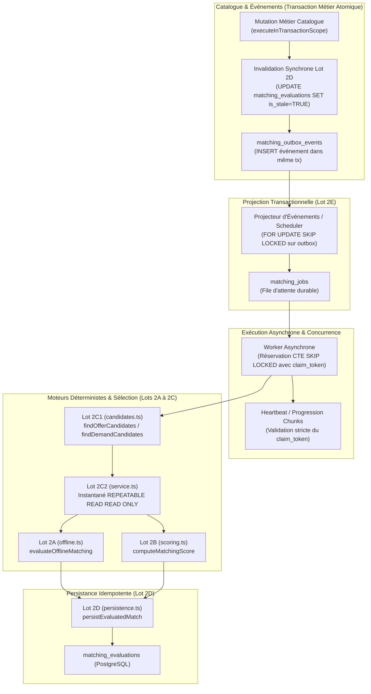
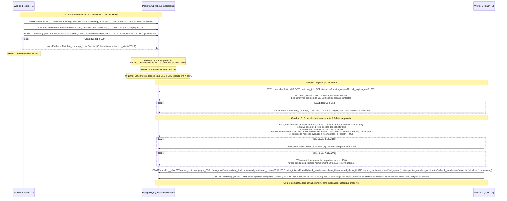

# MATCHING-ASYNC-PLAN.md — Cadrage Technique Outbox et Jobs de Matching (Lot 2E1)

Ce document définit l'architecture technique, le modèle relationnel, les protocoles transactionnels et la stratégie de tolérance aux pannes pour le déclenchement asynchrone du matching dans l'application **noma / Scoutr**.

Ce livrable est un **cadrage technique exclusif** : aucune migration de base de données n'est exécutée, aucun worker d'arrière-plan n'est démarré, aucun point d'accès d'API ni écran utilisateur n'est créé ou altéré.

---

## 1. Synthèse et Contexte Architectural

Le système de matching de noma rapproche offres et demandes structurées du catalogue sans aucun appel à un modèle de langage (LLM) par paire.
Les lots antérieurs ont déjà spécifié, éprouvé et audité les fondations suivantes :
- **Lot 2A** : Comparaison déterministe hors-ligne multidimensionnelle (`matching-offline/v1`).
- **Lot 2B** : Scoring explicable pondéré (`matching-scoring/v1`).
- **Lot 2C1** : Recherche paginée de candidats via index composites et exclusion d'auto-matching.
- **Lot 2C2** : Évaluation transactionnelle sous instantané `REPEATABLE READ READ ONLY`.
- **Lot 2C3** : Exposition HTTP sécurisée sous DTO filtré anti-fuite.
- **Lot 2D** : Persistance transactionnelle idempotente (`matching_evaluations`), détection d'obsolescence et invalidation atomique.

### Problématique du Traitement Synchrone
Dans le catalogue, une offre ou une demande peut avoir des dizaines ou des centaines de candidats admissibles. Évaluer l'intégralité de ces paires de manière synchrone pendant une requête HTTP de mutation catalogue (création, mise à jour, changement de statut) présenterait des risques rédhibitoires :
1. **Dépassement de timeout HTTP** et contention excessive sur le pool de connexions PostgreSQL.
2. **Couplage temporel fort** : l'indisponibilité ou la lenteur d'un calcul bloquerait la validation des annonces du vendeur ou des besoins de l'acheteur.
3. **Risque de corruption transactionnelle** en cas de crash intempestif ou d'abandon client pendant une boucle synchrone volumineuse.

### Principes Directeurs du Lot 2E1
Le lot 2E1 résout ce défi par le modèle **Transactional Outbox & Reliable Asynchronous Jobs** avec des invariants démontrables :
1. **Atomicité stricte à l'écriture** : La mutation métier du catalogue, l'invalidation synchrone des évaluations obsolètes existantes, et l'insertion d'un événement d'outbox sont scellées dans la **même transaction PostgreSQL** (`executeInTransactionScope`).
2. **Identité durable de travail (`job_identity`)** : Unicité canonique structurée discriminant chaque unité de travail légitime (événement source, type de job, ressource, version, cible, hash de configuration, génération). Évite tout rejet silencieux de travaux ultérieurs (deuxième demande temporelle, réactivation après complétion, nouvelle pondération).
3. **Réservation concurrente sans famine ni blocage** : Les jobs sont réservés via une expression de table commune (CTE) `FOR UPDATE SKIP LOCKED`. Les jobs expirés en statut `running` sont automatiquement réattribuables, y compris lors d'un crash à la dernière tentative.
4. **Identité de bail renouvelée (`claim_token`) et clôture stricte** : Chaque réservation génère un jeton UUID cryptographique unique. Toute transition d'état d'un worker (heartbeat, progression de page, échec, court-circuit `superseded`, complétion) exige la correspondance stricte de ce jeton ET la validité temporelle du bail (`lock_expires_at >= clock_timestamp()`).
5. **Protocole de tentative et persistance durable de chunk** : Reprise fiable par pagination à curseur, horodatage figé `chunk_evaluated_at`, dérivation déterministe d'`idempotency_key` pour chaque paire, classification des erreurs 2D et gestion des exécutions at-least-once.
6. **Balayage temporel atomique ciblé** : Invalidation concurrente sécurisée ciblant uniquement l'évaluation échue sans altérer une réévaluation concurrente plus fraîche.

---

## 2. Mapping Précis des Composants Réutilisés

Le graphe suivant illustre l'intégration du pipeline asynchrone avec l'ensemble des modules validés :



### Matrice Détaillée de Réemploi

| Composant | Fichiers Sources | Rôle & Invariants Réutilisés Sans Altération |
|---|---|---|
| **Lot 2A** | [`lib/server/matching/offline.ts`](file:///home/aegonjs/Documents/workspeace/Fresh/noma/lib/server/matching/offline.ts) | Évaluation multidimensionnelle déterministe. Contrat figé `matching-offline/v1`. Fournit statuts (`compatible`, `incompatible`, `unknown`), éligibilité, raisons explicables et calcul des frontières d'expiration temporelle ($D + 1\text{ ms}$). Zéro appel LLM. |
| **Lot 2B** | [`lib/server/matching/scoring.ts`](file:///home/aegonjs/Documents/workspeace/Fresh/noma/lib/server/matching/scoring.ts) | Scoring explicable pondéré. Contrat figé `matching-scoring/v1`. Fournit `score` (0.000000–100.000000) et `coverage`. Rejette toute promotion d'un statut incompatible ou inconnu en compatible. |
| **Lot 2C1** | [`lib/server/matching/candidates.ts`](file:///home/aegonjs/Documents/workspeace/Fresh/noma/lib/server/matching/candidates.ts) | Fonctions `findOfferCandidatesForDemand` et `findDemandCandidatesForOffer`. Pagination par curseur opaque microseconde `(created_at, id)` stable, plafonnée à `MAX_CANDIDATE_LIMIT` (100). Filtrage SQL strict : exclusion d'auto-matching (`owner_id <> target_owner_id`), statuts admissibles (`published`/`active`), exclusion `unavailable`. |
| **Lot 2C2** | [`lib/server/matching/service.ts`](file:///home/aegonjs/Documents/workspeace/Fresh/noma/lib/server/matching/service.ts) | Orchestration sous `withReadSnapshot` (`REPEATABLE READ READ ONLY`). Garantit que les candidats et la ressource pivot sont lus sous une vue transactionnelle immuable pendant l'évaluation en mémoire. |
| **Lot 2C3** | [`lib/server/matching/http-dto.ts`](file:///home/aegonjs/Documents/workspeace/Fresh/noma/lib/server/matching/http-dto.ts) | DTO de consultation avec liste blanche stricte anti-fuite. Aucune métadonnée interne d'outbox, de jeton de verrou ou de job n'est exposée aux utilisateurs. |
| **Lot 2D** | [`lib/server/matching/persistence.ts`](file:///home/aegonjs/Documents/workspeace/Fresh/noma/lib/server/matching/persistence.ts) | Fonction `persistEvaluatedMatch`. Ordre de verrouillage strict (`pg_advisory_xact_lock(idempotency)`, `users FOR SHARE`, `resources FOR SHARE`, `pg_advisory_xact_lock(pair)`). Détection des conflits de versions (`StalePreconditionsError`), barrière temporelle (`EvaluationExpiredDuringLockWaitError`), barrière historique (`StaleAttemptSupersededError`), et remplacement atomique de `is_latest`. |
| **Catalogue & Mutations** | [`lib/server/catalog/offers.ts`](file:///home/aegonjs/Documents/workspeace/Fresh/noma/lib/server/catalog/offers.ts)<br/>[`lib/server/catalog/demands.ts`](file:///home/aegonjs/Documents/workspeace/Fresh/noma/lib/server/catalog/demands.ts)<br/>[`lib/server/catalog/users.ts`](file:///home/aegonjs/Documents/workspeace/Fresh/noma/lib/server/catalog/users.ts)<br/>[`lib/server/catalog-extraction/application.ts`](file:///home/aegonjs/Documents/workspeace/Fresh/noma/lib/server/catalog-extraction/application.ts) | Mutations existantes orchestrées via `executeInTransactionScope`. Incrémentation stricte `content_version = content_version + 1` et verrous `FOR UPDATE`. |

---

## 3. Catalogue des Événements et Points d'Émission Atomiques

### Règle d'Or de l'Outbox Transactionnel
> **Invariant Absolu** : Aucun événement d'outbox ne doit être émis en dehors de la transaction PostgreSQL qui modifie le catalogue et invalide les évaluations. Si la transaction métier subit un rollback, l'événement d'outbox et l'invalidation sont annulés conjointement. Aucun worker ne peut traiter un événement fantôme.

### Catalogue Exhaustif des Événements

| Type d'Événement (`event_type`) | Déclencheur Métier | Rôle sur les Matchings | Déclenche Recherche Candidats ? |
|---|---|---|---|
| `offer.created` | `createOffer` sous transaction avec statut initial `published` | Rapproche la nouvelle offre avec les demandes actives existantes. | **Oui** (`evaluate_offer_candidates`) |
| `offer.published` | `publishOffer` (transition `draft` ou `paused` $\to$ `published`) | Offre devient disponible pour matching. | **Oui** (`evaluate_offer_candidates`) |
| `offer.available` | `updateOffer` (transition `availability_status` de `unavailable` vers `available` ou `reserved`) | Retour à disponibilité. Déclenche la recherche avec les demandes candidates. | **Oui** (`evaluate_offer_candidates`) |
| `offer.updated` | `updateOffer` ou `applyCatalogExtractionProposal` sur offre publiée | Invalide synchrone (`offer_updated`). Recalcule avec les demandes candidates. | **Oui** (`evaluate_offer_candidates`) |
| `offer.paused` | `pauseOffer` (transition `published` $\to$ `paused`) | Invalide synchrone (`offer_updated`). L'offre n'est plus éligible. | **Non** |
| `offer.unavailable` | `updateOffer` avec `availability_status = 'unavailable'` | Invalide synchrone (`offer_unavailable`). | **Non** |
| `offer.archived` | `archiveOffer` | Invalide synchrone (`offer_archived`). Retrait définitif. | **Non** |
| `demand.created` | `createDemand` sous transaction avec statut initial `active` | Rapproche la nouvelle demande avec les offres publiées existantes. | **Oui** (`evaluate_demand_candidates`) |
| `demand.activated` | `activateDemand` (transition `draft` ou `satisfied` $\to$ `active`) | Demande redevient active pour matching. | **Oui** (`evaluate_demand_candidates`) |
| `demand.updated` | `updateDemand` ou `applyCatalogExtractionProposal` sur demande active | Invalide synchrone (`demand_updated`). Recalcule avec les offres candidates. | **Oui** (`evaluate_demand_candidates`) |
| `demand.satisfied` | `satisfyDemand` (transition `active` $\to$ `satisfied`) | Invalide synchrone (`demand_satisfied`). Le besoin est comblé. | **Non** |
| `demand.archived` | `archiveDemand` | Invalide synchrone (`demand_archived`). Retrait définitif. | **Non** |
| `user.reactivated` | `updateUser` (transition `suspended` $\to$ `active`) | Propriétaire réactivé : recalcule ses offres publiées et demandes actives. | **Oui** (`user_reactivation_sweep`) |
| `user.suspended` | `updateUser` avec `status = 'suspended'` | Invalide synchrone (`user_suspended`) toutes les évaluations de l'utilisateur. | **Non** |
| `user.archived` | `archiveUser` | Invalide synchrone (`user_archived`) toutes les évaluations de l'utilisateur. | **Non** |
| `temporal.deadline_passed` | Balayeur temporel périodique (`expires_at <= clock_timestamp()`) | Invalide synchrone (`temporal_expiry`) la ligne ciblée. Réévalue la paire. | **Oui** (`reevaluate_pair_temporal`) |
| `scoring_config.updated` | Mise à jour de la configuration de pondération de référence | Invalide (`engine_superseded`). Rejeu ordonné des évaluations actives. | **Oui** (`scoring_config_sweep`) |
| `catalog.bootstrap_sync` | Synchronisation initiale / rattrapage du catalogue préexistant | Génère les jobs d'évaluation initiaux pour les ressources publiées existantes. | **Oui** (`evaluate_offer_candidates` / `evaluate_demand_candidates`) |

### Traitement des Créations Catalogue et Encapsulation Transactionnelle

Dans le code historique, `createOffer`, `createDemand` et `createUser` exécutaient un simple `db.query("INSERT ...")` sans `executeInTransactionScope`.
Pour garantir qu'aucun événement d'outbox ne soit inséré en cas d'échec ultérieur et que l'événement soit strictement atomique avec la ressource créée :
- **Prérequis d'Émission** : Les fonctions `createOffer`, `createDemand` et `createUser` sont encapsulées dans `executeInTransactionScope(db, async (tx) => ...)`.
- L'insertion dans la table métier et l'insertion dans `matching_outbox_events` s'exécutent sur le même client transactionnel `tx`. Si une contrainte d'intégrité échoue, aucun événement orphelin n'est émis.

Points d'appel exacts :
1. **`lib/server/catalog/offers.ts`** :
   - `createOffer` : dans `executeInTransactionScope`, si `status === 'published'` et `availability_status !== 'unavailable'`, appel immédiat à `recordOutboxEvent(tx, { eventType: 'offer.created', ... })`.
   - `updateOffer` : dans `executeInTransactionScope`, émission de `offer.unavailable` si l'offre devient indisponible, `offer.available` si elle redevient disponible depuis `unavailable`, ou `offer.updated` pour les autres modifications.
   - `transitionOfferStatus` (`publishOffer` / `pauseOffer`) : émission de `offer.published` ou `offer.paused` immédiatement après `invalidateMatchesForOffer`.
   - `archiveOffer` : émission de `offer.archived` immédiatement après `invalidateMatchesForOffer`.
2. **`lib/server/catalog/demands.ts`** :
   - `createDemand` : dans `executeInTransactionScope`, si `status === 'active'`, émission de `demand.created`.
   - `updateDemand` : émission de `demand.updated` immédiatement après `invalidateMatchesForDemand`.
   - `transitionDemandStatus` (`activateDemand` / `satisfyDemand`) : émission de `demand.activated` ou `demand.satisfied`.
   - `archiveDemand` : émission de `demand.archived`.
3. **`lib/server/catalog/users.ts`** :
   - `updateUser` : dans `executeInTransactionScope`, si transition vers `suspended`, émission de `user.suspended` ; si transition de `suspended` vers `active`, émission de `user.reactivated`.
   - `archiveUser` : émission de `user.archived`.
4. **`lib/server/catalog-extraction/application.ts`** :
   - `applyCatalogExtractionProposal` : lorsque `hasEffectiveChanges === true`, émission atomique dans la transaction de reçu de `offer.updated` ou `demand.updated`.

---

## 4. Modèle Relationnel et Migrations Additives

Deux tables PostgreSQL additives sont requises. Aucune table existante n'est altérée. Les migrations respectent strictement la numérotation ordonnée de `database/migrations/`.

### Migration `0007_matching_outbox_events.sql`

```sql
-- Migration 0007 : Journal d'événements transactionnels pour le matching (Outbox)
CREATE TABLE IF NOT EXISTS matching_outbox_events (
    id UUID PRIMARY KEY DEFAULT gen_random_uuid(),
    event_type TEXT NOT NULL,
    aggregate_type TEXT NOT NULL CHECK (aggregate_type IN ('offer', 'demand', 'user', 'temporal', 'system')),
    aggregate_id UUID NOT NULL,
    aggregate_version INTEGER CHECK (aggregate_version IS NULL OR aggregate_version > 0),
    target_aggregate_id UUID,
    payload JSONB NOT NULL DEFAULT '{}'::jsonb CHECK (jsonb_typeof(payload) = 'object'),
    occurred_at TIMESTAMPTZ NOT NULL DEFAULT clock_timestamp(),
    dispatched_at TIMESTAMPTZ,
    dispatch_status TEXT NOT NULL DEFAULT 'pending' CHECK (dispatch_status IN ('pending', 'projected', 'ignored')),
    error_message TEXT,
    CONSTRAINT chk_outbox_aggregate_version CHECK (
        (aggregate_type IN ('offer', 'demand') AND aggregate_version IS NOT NULL) OR
        (aggregate_type IN ('user', 'temporal', 'system'))
    )
);

-- Index pour la lecture séquentielle rapide des événements non encore projetés
CREATE INDEX IF NOT EXISTS idx_matching_outbox_pending ON matching_outbox_events (
    occurred_at ASC,
    id ASC
) WHERE (dispatch_status = 'pending');

-- Index de traçabilité pour audit par agrégat
CREATE INDEX IF NOT EXISTS idx_matching_outbox_aggregate ON matching_outbox_events (
    aggregate_type,
    aggregate_id,
    aggregate_version
);
```

### Migration `0008_matching_jobs.sql`

```sql
-- Migration 0008 : File de calcul asynchrone des correspondances (Jobs)
CREATE TABLE IF NOT EXISTS matching_jobs (
    id UUID PRIMARY KEY DEFAULT gen_random_uuid(),
    job_identity TEXT NOT NULL UNIQUE,
    job_type TEXT NOT NULL CHECK (job_type IN (
        'evaluate_offer_candidates',
        'evaluate_demand_candidates',
        'reevaluate_pair_temporal',
        'scoring_config_sweep',
        'user_reactivation_sweep'
    )),
    resource_id UUID NOT NULL,
    resource_version INTEGER NOT NULL CHECK (resource_version > 0),
    target_resource_id UUID,
    scoring_config_hash TEXT,
    cursor_position TEXT,
    chunk_evaluated_at TIMESTAMPTZ,
    chunk_manifest JSONB NOT NULL DEFAULT '{}'::jsonb,
    source_event_id UUID REFERENCES matching_outbox_events(id) ON DELETE SET NULL,
    status TEXT NOT NULL DEFAULT 'pending' CHECK (status IN (
        'pending', 'running', 'completed', 'failed', 'superseded', 'dead_letter'
    )),
    attempts INTEGER NOT NULL DEFAULT 0 CHECK (attempts >= 0),
    max_attempts INTEGER NOT NULL DEFAULT 5 CHECK (max_attempts > 0),
    locked_by TEXT,
    locked_at TIMESTAMPTZ,
    lock_expires_at TIMESTAMPTZ,
    claim_token UUID,
    scheduled_at TIMESTAMPTZ NOT NULL DEFAULT clock_timestamp(),
    created_at TIMESTAMPTZ NOT NULL DEFAULT clock_timestamp(),
    updated_at TIMESTAMPTZ NOT NULL DEFAULT clock_timestamp(),
    completed_at TIMESTAMPTZ,
    last_error TEXT,
    processed_candidates_count INTEGER NOT NULL DEFAULT 0,
    created_evaluations_count INTEGER NOT NULL DEFAULT 0,
    CONSTRAINT chk_matching_jobs_lock_coherence CHECK (
        (status = 'running' AND locked_by IS NOT NULL AND locked_at IS NOT NULL AND lock_expires_at IS NOT NULL) OR
        (status <> 'running')
    )
);

-- Index critique pour la réservation concurrente SKIP LOCKED sans blocage
CREATE INDEX IF NOT EXISTS idx_matching_jobs_reservation ON matching_jobs (
    scheduled_at ASC,
    id ASC
) WHERE (status IN ('pending', 'failed') AND attempts < max_attempts);

-- Index pour détecter immédiatement l'obsolescence d'une ressource par rapport à sa version courante
CREATE INDEX IF NOT EXISTS idx_matching_jobs_resource_lookup ON matching_jobs (
    resource_id,
    resource_version DESC,
    created_at DESC
);

-- Index pour la supervision des jobs morts (Dead-Letter Queue)
CREATE INDEX IF NOT EXISTS idx_matching_jobs_dead_letter ON matching_jobs (
    updated_at DESC
) WHERE (status = 'dead_letter');
```

### Spécification de l'Identité Durable de Travail (`job_identity`)

L'ancienne contrainte `UNIQUE (job_type, resource_id, resource_version)` était viciée : elle écrasait ou rejetait silencieusement tout travail légitime survenant alors qu'un job antérieur existait déjà pour la même version :
1. **Paires temporelles multiples** : pour une offre à la version 1 ayant des échéances distinctes avec deux demandes $D_1$ et $D_2$, le second job `reevaluate_pair_temporal` était rejeté en conflit avec le premier.
2. **Réactivation après complétion** : si l'utilisateur suspendait puis réactivait son offre sans modifier son contenu textuel (`content_version` reste 1), l'insertion du job d'évaluation échouait car le job de la création initiale (déjà `completed`) occupait la clé d'unicité.
3. **Changement de configuration de scoring** : une modification des pondérations administratives sans changement de version catalogue rejetait l'évaluation `scoring_config_sweep`.

Rendre l'index partiel (par exemple `WHERE status IN ('pending', 'running')`) ne résolvait pas le problème : rejouer un même événement après complétion aurait alors recréé un job doublon, brisant l'idempotence de projection.

#### Composition Canonique et Provenance Durable de `job_identity`
La colonne `job_identity` est **obligatoire et unique sans valeur par défaut aléatoire** (`NOT NULL UNIQUE`). Toute omission ou valeur `NULL` est immédiatement rejetée au niveau relationnel, interdisant toute génération silencieuse d'identités divergentes.

La clé d'unicité est dérivée par hachage SHA-256 d'un objet JSON canonique dont les clés sont strictement triées par ordre lexicographique :
$$\text{job\_identity} = \text{SHA256}(\text{canonical\_json}(\{ \text{generation}, \text{job\_type}, \text{resource\_id}, \text{resource\_version}, \text{scoring\_config\_hash}, \text{source\_event\_id}, \text{target\_resource\_id} \}))$$

Chaque composante provient exclusivement de données durables et immuables scellées dans l'événement outbox à l'instant de son émission :
- **`source_event_id`** : L'identifiant immuable `matching_outbox_events.id` (UUID).
- **`job_type`** : Déterminé de façon déterministe à partir de l'`event_type` et de l'`aggregate_type`.
- **`resource_id`** : La valeur immuable `matching_outbox_events.aggregate_id`.
- **`resource_version`** : La version immuable `matching_outbox_events.aggregate_version` (le `content_version` capturé lors de la mutation catalogue).
- **`target_resource_id`** : La cible immuable `matching_outbox_events.target_aggregate_id` (ou `NULL`).
- **`scoring_config_hash`** : Le hash de la pondération de référence **scellé dans la charge utile de l'événement lors de sa création** (`payload->>'scoring_config_hash'`). Le projecteur ne relit jamais une configuration courante variable en base : une projection répétée d'un événement antérieur réutilise strictement la configuration scellée à l'émission.
- **`generation`** : Entier de génération du cycle de vie scellé dans l'événement outbox (`payload->>'generation'`), incrémenté atomiquement lors de chaque transition de suspension/réactivation.

**Propriétés Invariables** :
- **Répétition de projection** : Une projection répétée du même événement outbox reconstruit mathématiquement la même `job_identity`. L'instruction `ON CONFLICT (job_identity) DO NOTHING` garantit l'idempotence stricte, y compris lorsque le job initial est déjà en statut `completed`, `superseded` ou `dead_letter`.
- **Nouveau travail légitime** : Tout travail distinct (nouvelle échéance temporelle avec cible différente, réactivation avec génération incrémentée, mise à jour de scoring avec hash distinct) possède une `job_identity` différente et s'insère immédiatement (`rowCount = 1`).

---

## 5. Réservation Concurrente, Identité de Bail et Tolérance aux Pannes

### A. Protocole de Réservation Concurrente (`FOR UPDATE SKIP LOCKED`)
Pour permettre à plusieurs instances de workers de traiter la file d'attente sans conflit ni blocage mutuel, la réservation s'effectue au moyen d'une expression de table commune (CTE) atomique avec `SKIP LOCKED`.

Le prédicat d'éligibilité intègre formellement les jobs au statut `running` dont le bail a expiré (`lock_expires_at < clock_timestamp()`), garantissant qu'aucun job ne reste bloqué indéfiniment après un crash :

```sql
WITH claimable AS (
    SELECT id
      FROM matching_jobs
     WHERE (
             status IN ('pending', 'failed')
             OR (status = 'running' AND lock_expires_at < clock_timestamp())
           )
       AND attempts < max_attempts
       AND scheduled_at <= clock_timestamp()
     ORDER BY scheduled_at ASC, id ASC
     LIMIT $1
       FOR UPDATE SKIP LOCKED
)
UPDATE matching_jobs j
   SET status = 'running',
       locked_by = $2,
       locked_at = clock_timestamp(),
       lock_expires_at = clock_timestamp() + interval '90 seconds',
       claim_token = gen_random_uuid(),
       attempts = attempts + 1,
       updated_at = clock_timestamp()
  FROM claimable
 WHERE j.id = claimable.id
RETURNING j.*;
```

### B. Identité de Bail Renouvelée (`claim_token`) et Protection Anti-Retardataire
À chaque réservation (première attribution ou récupération après expiration), un nouveau jeton cryptographique `claim_token = gen_random_uuid()` est généré.
Ce jeton constitue l'identité de session exclusive du worker.

Toutes les opérations d'avancement du cycle de vie du job exigent :
1. La correspondance exacte de l'`id`.
2. La correspondance exacte du `claim_token`.
3. Le maintien de `status = 'running'`.
4. La non-expiration du bail (`lock_expires_at >= clock_timestamp()`).

#### 1. Heartbeat Périodique (Prolongation de Bail)
Le worker prolonge son bail toutes les 30 secondes tant qu'il progresse sur un chunk :
```sql
UPDATE matching_jobs
   SET lock_expires_at = clock_timestamp() + interval '90 seconds',
       updated_at = clock_timestamp()
 WHERE id = $1
   AND claim_token = $2
   AND status = 'running'
   AND lock_expires_at >= clock_timestamp();
```
Si le worker a été victime d'un gel réseau ou d'une pause garbage collector ayant entraîné l'expiration de son bail, la requête ci-dessus retourne `rowCount = 0`. Le worker constate la perte de son bail et s'arrête immédiatement sans écriture corrompue.

#### 2. Enregistrement de Progression de Chunk
Après avoir persisté une tranche de candidats et calculé `next_cursor`, le worker valide sa progression :
```sql
UPDATE matching_jobs
   SET cursor_position = $3,
       processed_candidates_count = processed_candidates_count + $4,
       created_evaluations_count = created_evaluations_count + $5,
       lock_expires_at = clock_timestamp() + interval '90 seconds',
       updated_at = clock_timestamp()
 WHERE id = $1
   AND claim_token = $2
   AND status = 'running'
   AND lock_expires_at >= clock_timestamp();
```

#### 3. Échec Borné avec Backoff Exponentiel et Clôture Stricte
Lorsqu'une erreur transitoire ou permanente survient, le traitement des échecs applique un backoff réellement borné ($\le 600\text{ s}$) sans dépassement arithmétique.

Le worker actif applique la mise à jour suivante, qui requiert obligatoirement le `claim_token` courant ET la validité active du bail :
```sql
UPDATE matching_jobs
   SET status = CASE WHEN attempts >= max_attempts THEN 'dead_letter'::text ELSE 'failed'::text END,
       locked_by = NULL,
       locked_at = NULL,
       lock_expires_at = NULL,
       claim_token = NULL,
       scheduled_at = clock_timestamp() + (interval '1 second' * LEAST(600, power(2, LEAST(attempts, 10)) * 2)),
       last_error = $3,
       completed_at = CASE WHEN attempts >= max_attempts THEN clock_timestamp() ELSE NULL END,
       updated_at = clock_timestamp()
 WHERE id = $1
   AND claim_token = $2
   AND status = 'running'
   AND lock_expires_at >= clock_timestamp();
```
Si le worker a perdu son bail pendant son exécution (timeout, expiration), cette requête retourne `rowCount = 0`. Le worker s'interrompt immédiatement sans modifier l'état du job. Aucune écriture non clôturée n'est autorisée pour un worker.

#### 4. Court-Circuit Immédiat (`superseded`) sous Bail Valide
Si pendant l'exécution ou avant le traitement d'une nouvelle page, le worker détecte que la version de la ressource dans le catalogue a évolué (`current.content_version > job.resource_version`), le job courant est devenu obsolète. Le worker court-circuite le job en statut `'superseded'`. Cette écriture exige impérativement le `claim_token` courant et la validité active du bail :

```sql
UPDATE matching_jobs
   SET status = 'superseded',
       locked_by = NULL,
       locked_at = NULL,
       lock_expires_at = NULL,
       claim_token = NULL,
       completed_at = clock_timestamp(),
       updated_at = clock_timestamp()
 WHERE id = $1
   AND claim_token = $2
   AND status = 'running'
   AND lock_expires_at >= clock_timestamp();
```
Si le bail a expiré entre-temps (`lock_expires_at < clock_timestamp()`) ou si le job a été réclamé par un autre worker avec un jeton distinct, cette requête retourne `rowCount = 0`. Le worker retardataire s'arrête sans altérer l'état du job.

#### 5. Protocole de Maintenance des Baux Échus et Jobs Épuisés
La récupération des jobs orphelins (crash d'un worker à la dernière tentative ou panne prolongée) est **strictement réservée au protocole de maintenance**, évitant toute collision avec les workers :
1. **Jobs Réessayables (`attempts < max_attempts`)** : Ils sont automatiquement réclamés par les workers actifs via la clause `OR (status = 'running' AND lock_expires_at < clock_timestamp())` de la CTE `claimable`.
2. **Jobs Épuisés (`attempts >= max_attempts`)** : Qu'ils soient restés en `running` avec bail expiré suite à un crash brutal ou en `failed` au terme des tentatives autorisées, ils sont formellement reclassés en `dead_letter` par le processus périodique de maintenance. Aucun état `failed` ou `running` épuisé ne reste bloqué indéfiniment :

```sql
UPDATE matching_jobs
   SET status = 'dead_letter',
       locked_by = NULL,
       locked_at = NULL,
       lock_expires_at = NULL,
       claim_token = NULL,
       last_error = COALESCE(last_error, 'Tentatives maximales autorisées épuisées ou bail expiré.'),
       completed_at = clock_timestamp(),
       updated_at = clock_timestamp()
 WHERE (
         (status = 'running' AND lock_expires_at < clock_timestamp() AND attempts >= max_attempts)
         OR (status = 'failed' AND attempts >= max_attempts)
       );
```

#### 6. Complétion du Job
Lorsque tous les candidats ont été parcourus (`hasMore = false`), le worker clôture le job sous réserve expresse que le dernier chunk soit validé et que la fin de parcours soit actée dans le manifeste :
```sql
UPDATE matching_jobs
   SET status = 'completed',
       locked_by = NULL,
       locked_at = NULL,
       lock_expires_at = NULL,
       claim_token = NULL,
       completed_at = clock_timestamp(),
       updated_at = clock_timestamp()
 WHERE id = $1
   AND claim_token = $2
   AND status = 'running'
   AND lock_expires_at >= clock_timestamp()
   AND chunk_manifest->>'state' = 'validated'
   AND (chunk_manifest->>'is_eof')::boolean = true;
```

---

---

---

## 6. Protocole Durable de Tentative, Idempotence et Écritures en Vol

### A. Réutilisation Stricte de la Pagination de Candidats Lot 2C1
La sélection des candidats réutilise strictement l'implémentation validée de `lib/server/matching/candidates.ts` (`findOfferCandidatesForDemand` et `findDemandCandidatesForOffer`), sans substitution ni approximation :
1. **Ordre Déterministe Strict** : Tri composite décroissant `ORDER BY created_at DESC, id DESC`.
2. **Comparaison de Curseur** : Filtrage strict par tuple `AND (created_at, id) < ($cursorDate::timestamptz, $cursorId::uuid)`.
3. **Curseur Opaque Complet (`nextCursor`)** : Le curseur est une chaîne `base64url` encodant la structure `{ createdAtIso, id }` avec préservation de la précision microseconde UTC (`YYYY-MM-DDTHH:mm:ss.SSSSSSZ`).
4. **Stockage dans `matching_jobs`** : La colonne `cursor_position TEXT` enregistre **exclusivement ce `nextCursor` opaque complet** (ou `NULL` pour le premier chunk). La substitution d'un simple UUID est formellement interdite.

### B. Identité, État, Révision et Manifeste Durable de Chunk
Pour garantir la reprise transparente sans perte ni écrasement lors d'un crash :
- **Identité, État et Révision du Chunk** : Chaque chunk possède obligatoirement un `chunk_id` (UUID), un `chunk_index` (entier séquentiel $\ge 0$), un numéro de révision séquentiel `manifest_version` (entier $\ge 1$), et un état persistant :
  `state: 'initialized' | 'processing' | 'validated'`.
- **Contrat Paramétré Explicite (Strict CAS)** :
  Toute mutation d'un chunk existant prend obligatoirement des paramètres explicites :
  - `expected_chunk_id` (UUID) : identifiant du chunk attendu en base ;
  - `expected_manifest_version` (entier $\ge 1$) : numéro de révision exact attendu en base avant mutation ;
  - `next_manifest` (JSONB) : charge utile scellée du nouveau manifeste.
- **Règles Atomiques Inviolables de Mutation** :
  Pour chaque mutation (ajout de tentative, acquittement unitaire, validation de progression) :
  1. Le `claim_token` courant et le bail actif sont validés (`claim_token = $2 AND lock_expires_at >= clock_timestamp()`).
  2. Le `chunk_id` courant en base doit être strictement égal à `expected_chunk_id`.
  3. Le `manifest_version` courant en base doit être strictement égal à `expected_manifest_version`.
  4. L'état courant en base doit autoriser l'opération (`state IN ('initialized', 'processing')`).
  5. Le nouveau manifeste `next_manifest` conserve obligatoirement le `chunk_id` (`next_manifest.chunk_id = expected_chunk_id`) et reçoit exactement `expected_manifest_version + 1`. **Aucun saut de révision n'est toléré** : toute proposition avec `manifest_version != expected_manifest_version + 1` ou une révision arbitrairement supérieure (gap) est rejetée atomiquement (`rowCount = 0`).
  6. **Suppression intégrale des contournements et fallbacks synthétiques** :
     - Suppression de toutes les branches acceptant un `chunk_id` absent.
     - Suppression de toutes les branches acceptant une `manifest_version` absente.
     - Suppression définitive de la comparaison « version courante < version proposée ».
     - Suppression de toute valeur implicite (`COALESCE` permissif ou repli synthétique) permettant de contourner les champs obligatoires.
     - Les champs structurants sont obligatoires et validés. Une entrée mal formée est refusée sans modification de la base.
     - Les anciennes fixtures sans identité/révision sont adaptées au nouveau contrat ; aucun fallback « synthétique » n'est conservé.
- **Non-Concurrence sur la Même Révision** : Deux opérations fondées sur la même révision ne peuvent pas toutes deux réussir. La première qui s'exécute incrémente `manifest_version` de $R$ à $R+1$ (`rowCount = 1`). La seconde, calculée sur la même révision $R$, tente également de poser $R+1$ et est immédiatement rejetée (`rowCount = 0`). La seconde opération doit obligatoirement **relire l'état complet en base avant de reconstruire sa modification**, sans perdre celle de la première.
- **Vérification Réelle après Réponse Perdue** : Une réponse perdue impose une relecture et une **vérification explicite de l'opération réellement appliquée** (ex: présence effective de l'identifiant de tentative ou du statut de persistance unitaire). Une révision supérieure seule ne prouve pas que cette opération a réussi, car un autre worker ou une autre étape a pu faire progresser la révision.
- **Horodatage Figé (`chunk_evaluated_at`)** : À l'ouverture d'un chunk, le worker fixe $T_{\text{eval}} = \text{clock\_timestamp()}$. Cette valeur est passée à l'identique à toutes les paires du lot pour stabiliser les calculs Lot 2A (`Date.getTime()`) et fixer $B = D + 1\text{ ms}$.
- **Conservation Complète de CHAQUE Tentative** :
  Le manifeste stocké dans `matching_jobs.chunk_manifest` conserve l'historique complet de **chaque tentative** d'évaluation, et non un simple état écrasable :
  ```json
  {
    "chunk_id": "<uuid>",
    "chunk_index": 0,
    "manifest_version": 1,
    "state": "initialized",
    "predecessor_chunk_id": null,
    "predecessor_manifest_version": null,
    "cursor_in": "<opaque_2c1_cursor | null>",
    "cursor_out": "<opaque_2c1_cursor | null>",
    "is_eof": false,
    "evaluated_at": "2026-10-04T12:00:00.000Z",
    "scoring_config_hash": "<64_hex_chars>",
    "engine_offline_version": "matching-offline/v1",
    "engine_scoring_version": "matching-scoring/v1",
    "candidates": [
      {
        "candidate_id": "<uuid>",
        "candidate_version": 1,
        "pair_resource_id": "<uuid>",
        "pair_resource_version": 1,
        "status": "pending",
        "current_attempt_id": "<uuid>",
        "attempts": [
          {
            "attempt_id": "<uuid>",
            "evaluated_at": "2026-10-04T12:00:00.000Z",
            "scoring_config_hash": "<64_hex_chars>",
            "engine_offline_version": "matching-offline/v1",
            "engine_scoring_version": "matching-scoring/v1",
            "idempotency_key": "<uuid>",
            "attempt_hash": "<64_hex_chars>",
            "status": "pending",
            "error_class": null
          }
        ]
      }
    ]
  }
  ```
  **Règle d'Append-Only des Tentatives** : Lorsqu'un recalcul est requis (ex: expiration de délai pendant l'attente de verrous), une **nouvelle tentative est ajoutée** à la liste `attempts`. Elle ne remplace jamais les informations de la précédente, préservant ainsi la traçabilité intégrale et la capacité de rejeu idempotent de chaque tentative.

### C. Transactions SQL Protégées du Protocole de Chunk

Toutes les mutations de la file d'exécution sont strictement protégées par le bail actif (`claim_token = $2 AND lock_expires_at >= clock_timestamp()`) et appliquent un contrôle Compare-And-Swap (CAS) strict sur l'état attendu :

#### 1. Initialisation Conditionnelle du Manifeste de Chunk
Dès que les candidats du lot sont extraits via 2C1, le worker scelle le manifeste (`state = 'initialized'`, `manifest_version = 1`).
Cette initialisation est **strictement conditionnelle** et valide obligatoirement les champs structurants :
1. Première initialisation (chunk 0) : s'applique exclusivement sur l'état initial exact (`chunk_manifest = '{}'::jsonb`, `chunk_index = 0`, aucun prédécesseur).
2. Chunk suivant ($N > 0$) : vérifie explicitement l'identité (`predecessor_chunk_id`) et la révision (`predecessor_manifest_version`) du prédécesseur attendu, obligatoirement au statut `'validated'` et non terminé (`is_eof = false`).
3. Aucune réinitialisation d'un parcours terminé : si `is_eof = true`, toute initialisation est rejetée.
4. Tout champ obligatoire manquant ou toute entrée mal formée provoque le rejet immédiat (`rowCount = 0`) sans altération de la base.

```sql
UPDATE matching_jobs
   SET chunk_evaluated_at = $3,
       chunk_manifest = $4::jsonb,
       lock_expires_at = clock_timestamp() + interval '90 seconds',
       updated_at = clock_timestamp()
 WHERE id = $1
   AND claim_token = $2
   AND status = 'running'
   AND lock_expires_at >= clock_timestamp()
   -- Validation stricte des champs structurants du nouveau manifeste (aucun contournement implicite)
   AND ($4::jsonb->>'chunk_id') IS NOT NULL
   AND ($4::jsonb->>'chunk_index') IS NOT NULL
   AND ($4::jsonb->>'manifest_version') IS NOT NULL
   AND ($4::jsonb->>'manifest_version')::int = 1
   AND ($4::jsonb->>'state') = 'initialized'
   AND ($4::jsonb->>'is_eof') IS NOT NULL
   AND (
         -- Cas 1 : Première initialisation (chunk 0) sur l'état initial exact
         (
           chunk_manifest = '{}'::jsonb
           AND ($4::jsonb->>'chunk_index')::int = 0
           AND ($4::jsonb->>'predecessor_chunk_id') IS NULL
           AND ($4::jsonb->>'predecessor_manifest_version') IS NULL
         )
         -- Cas 2 : Chunk suivant (chunk_index > 0) vérifiant explicitement
         -- l'identité et la révision exacte du prédécesseur validé, non EOF
         OR (
           chunk_manifest->>'chunk_id' IS NOT NULL
           AND chunk_manifest->>'manifest_version' IS NOT NULL
           AND chunk_manifest->>'chunk_index' IS NOT NULL
           AND chunk_manifest->>'state' = 'validated'
           AND (chunk_manifest->>'is_eof')::boolean = false
           AND ($4::jsonb->>'predecessor_chunk_id') IS NOT NULL
           AND ($4::jsonb->>'predecessor_manifest_version') IS NOT NULL
           AND chunk_manifest->>'chunk_id' = ($4::jsonb->>'predecessor_chunk_id')
           AND (chunk_manifest->>'manifest_version')::int = ($4::jsonb->>'predecessor_manifest_version')::int
           AND ($4::jsonb->>'chunk_id') IS DISTINCT FROM chunk_manifest->>'chunk_id'
           AND ($4::jsonb->>'chunk_index')::int = (chunk_manifest->>'chunk_index')::int + 1
         )
       );
```
- **Préconditions** : Job en statut `running`, bail actif sous le jeton courant.
- **Diagnostic et Traitement de rowCount = 0** :
  Si la requête retourne `0`, le worker ne présume rien sur la position du curseur et relit immédiatement l'état :
  `SELECT status, claim_token, lock_expires_at, chunk_manifest FROM matching_jobs WHERE id = $1;`
  1. *Bail perdu ou réassigné* (`claim_token IS DISTINCT FROM $2` ou `status != 'running'` ou `lock_expires_at < clock_timestamp()`) : abandon immédiat sans écriture.
  2. *Opération déjà appliquée (réponse réseau perdue)* : le worker vérifie explicitement si `chunk_manifest->>'chunk_id' = ($4::jsonb->>'chunk_id')`. Si le chunk a déjà été initialisé lors d'un essai précédent, le worker poursuit l'évaluation. Une révision supérieure seule ne prouve pas le succès de l'opération demandée.
  3. *État dépassé, prédécesseur non validé ou parcours terminé* : le chunk précédent n'est pas encore validé, ne correspond pas à l'identité/révision attendue, ou `chunk_manifest->>'is_eof' = 'true'`. Requête rejetée.

#### 2. Enregistrement d'une Nouvelle Tentative (Recalcul Détecté)
Lorsqu'une paire nécessite une nouvelle tentative (ex: `EvaluationExpiredDuringLockWaitError` lors de la persistance), le worker inscrit cette nouvelle tentative dans le manifeste (`state = 'processing'`).
L'opération est régie par des paramètres explicites :
- `expected_chunk_id` : identifiant du chunk en cours ;
- `expected_manifest_version` : version courante exacte attendue en base ;
- `next_manifest` : nouveau manifeste scellé conservant `chunk_id` et portant exactement `expected_manifest_version + 1`.

La mise à jour atomique exige la correspondance stricte du bail, du `chunk_id`, de la révision sans saut, et d'un état autorisant l'opération :
```sql
UPDATE matching_jobs
   SET chunk_manifest = $3::jsonb,
       lock_expires_at = clock_timestamp() + interval '90 seconds',
       updated_at = clock_timestamp()
 WHERE id = $1
   AND claim_token = $2
   AND status = 'running'
   AND lock_expires_at >= clock_timestamp()
   -- Invariants stricts CAS : identité, révision séquentielle sans saut, état autorisant l'opération
   AND chunk_manifest->>'chunk_id' IS NOT NULL
   AND ($3::jsonb->>'chunk_id') IS NOT NULL
   AND chunk_manifest->>'chunk_id' = ($3::jsonb->>'chunk_id')
   AND chunk_manifest->>'manifest_version' IS NOT NULL
   AND ($3::jsonb->>'manifest_version') IS NOT NULL
   AND ($3::jsonb->>'manifest_version')::int = (chunk_manifest->>'manifest_version')::int + 1
   AND chunk_manifest->>'state' IN ('initialized', 'processing')
   AND ($3::jsonb->>'state') = 'processing';
```
- **Préconditions** : Bail actif. Chunk en cours (`initialized` ou `processing`). `chunk_id` conservé. Révision exactement incrémentée de 1.
- **Diagnostic et Règle de Non-Concurrence si rowCount = 0** :
  Le worker relit l'état : `SELECT status, claim_token, lock_expires_at, chunk_manifest FROM matching_jobs WHERE id = $1;`
  1. *Bail perdu ou réassigné* : abandon immédiat.
  2. *Réponse réseau perdue* : le worker inspecte le contenu effectif du manifeste rechargé. Il vérifie la présence réelle de la nouvelle tentative (`attempt_id`). Une révision supérieure seule ne prouve pas que cette tentative a été enregistrée. Si la tentative est confirmée en base, il poursuit l'évaluation.
  3. *Concurrence sur la même révision* : deux opérations fondées sur la même révision ne peuvent pas toutes deux réussir ; la seconde reçoit `rowCount = 0`. Le worker doit obligatoirement relire le manifeste frais, intégrer les modifications de la première opération, reconstruire sa nouvelle tentative sur cet état frais avec la nouvelle révision attendue, sans perdre l'avancement antérieur.

#### 3. Acquittement d'un Résultat Unitaire de Persistance
Après retour de `persistEvaluatedMatch` (Lot 2D), le worker met à jour le statut du candidat et de sa tentative courante (`persisted`, `replayed`, `skipped_stale`, `already_superseded`).
L'opération est régie par les mêmes paramètres explicites (`expected_chunk_id`, `expected_manifest_version`, `next_manifest`) et exige atomiquement :
```sql
UPDATE matching_jobs
   SET chunk_manifest = $3::jsonb,
       lock_expires_at = clock_timestamp() + interval '90 seconds',
       updated_at = clock_timestamp()
 WHERE id = $1
   AND claim_token = $2
   AND status = 'running'
   AND lock_expires_at >= clock_timestamp()
   -- Invariants stricts CAS : identité, révision séquentielle sans saut, état autorisant l'opération
   AND chunk_manifest->>'chunk_id' IS NOT NULL
   AND ($3::jsonb->>'chunk_id') IS NOT NULL
   AND chunk_manifest->>'chunk_id' = ($3::jsonb->>'chunk_id')
   AND chunk_manifest->>'manifest_version' IS NOT NULL
   AND ($3::jsonb->>'manifest_version') IS NOT NULL
   AND ($3::jsonb->>'manifest_version')::int = (chunk_manifest->>'manifest_version')::int + 1
   AND chunk_manifest->>'state' IN ('initialized', 'processing');
```
- **Préconditions** : Bail actif sous le jeton courant.
- **Diagnostic si rowCount = 0** :
  Relecture immédiate. Si bail perdu $\to$ interruption immédiate (la ligne 2D reste protégée par son empreinte d'idempotence). Si réponse perdue, le worker vérifie explicitement si le candidat en question présente le statut acquitté. Une révision supérieure seule ne prouve pas le succès de l'écriture. Si un conflit de révision concurrente survient, le worker relit le manifeste, fusionne sa mise à jour unitaire par-dessus les modifications concurrentes, et réexécute le CAS.

#### 4. Validation de Progression de Chunk Idempotente (CAS sur État Attendu)
Lorsque tous les candidats du manifeste sont résolus, le worker valide le lot (`state = 'validated'`), incrémente `manifest_version` exactement de 1, et applique atomiquement la progression :
- Paramètres explicites : `expected_chunk_id`, `expected_manifest_version`, `next_manifest` (avec `state = 'validated'`).
```sql
UPDATE matching_jobs
   SET cursor_position = $3,
       chunk_manifest = $4::jsonb,
       processed_candidates_count = processed_candidates_count + $5,
       created_evaluations_count = created_evaluations_count + $6,
       lock_expires_at = clock_timestamp() + interval '90 seconds',
       updated_at = clock_timestamp()
 WHERE id = $1
   AND claim_token = $2
   AND status = 'running'
   AND lock_expires_at >= clock_timestamp()
   -- Invariants stricts CAS : identité, révision séquentielle sans saut, état autorisant la validation
   AND chunk_manifest->>'chunk_id' IS NOT NULL
   AND ($4::jsonb->>'chunk_id') IS NOT NULL
   AND chunk_manifest->>'chunk_id' = ($4::jsonb->>'chunk_id')
   AND chunk_manifest->>'manifest_version' IS NOT NULL
   AND ($4::jsonb->>'manifest_version') IS NOT NULL
   AND ($4::jsonb->>'manifest_version')::int = (chunk_manifest->>'manifest_version')::int + 1
   AND chunk_manifest->>'state' IN ('initialized', 'processing')
   AND ($4::jsonb->>'state') = 'validated';
```
- **Préconditions** : Toutes les paires du chunk sont résolues. Bail actif sous le jeton courant. Identité et révision exacte vérifiées sans aucun fallback synthétique.
- **Préservation des Curseurs et Absence de Sentinelle** :
  `cursor_position` enregistre **exclusivement des curseurs 2C1 valides ou `NULL`** (pour la première page ou lorsqu'aucun curseur 2C1 n'est émis). **Aucune sentinelle artificielle comme `'EOF'` n'est autorisée dans `cursor_position`**. C'est le champ booléen `is_eof: true` dans `chunk_manifest` qui atteste formellement de la fin de parcours.
- **Validation de la Dernière Page sans Altération du Curseur** :
  Sur la dernière page (`nextCursor = null`), le curseur reste identique au curseur précédent (ou `NULL` si page unique). La validation réussit avec `rowCount = 1` car la vérification atomique porte sur `chunk_id`, `manifest_version = expected + 1` et `state IN ('initialized', 'processing')`, sans exiger de modification de `cursor_position`.
- **Diagnostic et Traitement de rowCount = 0 (sans présumer du curseur)** :
  En cas de `rowCount = 0`, le worker relit immédiatement le job :
  `SELECT claim_token, lock_expires_at, status, cursor_position, chunk_manifest FROM matching_jobs WHERE id = $1;`
  1. *Bail perdu ou réassigné* : `claim_token != $claim` ou bail expiré $\to$ arrêt immédiat.
  2. *Opération déjà appliquée (réponse réseau perdue)* : `chunk_manifest->>'chunk_id' = expected_chunk_id` et `chunk_manifest->>'state' = 'validated'`. Le worker vérifie formellement que la validation de ce chunk exact a été scellée (une révision supérieure seule ne suffit pas). Le lot a déjà été comptabilisé et validé, le worker peut enchaîner sans recompter.
  3. *Ancien acquittement tardif dépassé* : `chunk_manifest->>'chunk_id'` correspond à un chunk ultérieur (`chunk_index` plus grand). La requête tardive d'un chunk antérieur est rejetée sans altérer le curseur ni réincrémenter les compteurs.

#### 5. Transaction de Clôture du Job
Lorsque tous les candidats ont été parcourus et que la dernière page a été validée, le worker clôture le job. La complétion exige en SQL un chunk **au statut `'validated'` ET `is_eof = true`** sous bail actif :
```sql
UPDATE matching_jobs
   SET status = 'completed',
       locked_by = NULL,
       locked_at = NULL,
       lock_expires_at = NULL,
       claim_token = NULL,
       completed_at = clock_timestamp(),
       updated_at = clock_timestamp()
 WHERE id = $1
   AND claim_token = $2
   AND status = 'running'
   AND lock_expires_at >= clock_timestamp()
   AND chunk_manifest->>'state' = 'validated'
   AND (chunk_manifest->>'is_eof')::boolean = true;
```
- **Préconditions** : Bail actif. Chunk validé et `is_eof = true`.
- **Diagnostic si rowCount = 0** : Si le bail a été perdu entre-temps, le worker repreneur constatera `state = 'validated'` et `is_eof = true` et finalisera directement la clôture sans relancer de pagination.

### D. Classification et Traitement des Retours Lot 2D
Lors de l'appel à `persistEvaluatedMatch`, le worker distingue rigoureusement les retours :

| Événement / Retour Lot 2D | Statut Candidat dans Manifeste | Action & Alignement Lot 2D |
|---|---|---|
| **Succès normal / Rejeu (`{ isReplayed }`)** | `'persisted'` / `'replayed'` | Persistance confirmée ou réutilisation sans écriture double. Compteur `created_evaluations_count` incrémenté si nouveau. |
| **Pivot Obsolète (`current.content_version > job.resource_version`)** | Job bascule `'superseded'` | Le worker court-circuite le job en `superseded` sous bail valide et s'interrompt immédiatement. La version ultérieure a déjà son propre événement outbox. |
| **Candidat Obsolète (`StalePreconditionsError`)** | `'skipped_stale'` | Version du candidat modifiée ou archivée au moment du verrou 2D. Non fatal : candidat marqué sauté, `processed_candidates_count` incrémenté, passage au candidat suivant. |
| **Résultat Déjà Remplacé (`StaleAttemptSupersededError`)** | `'already_superseded'` | Une évaluation plus récente existe déjà pour la paire. Marqué sauté dans le manifeste, passage au candidat suivant. |
| **Expiration pendant Attente de Verrou (`EvaluationExpiredDuringLockWaitError`)** | Nouvelle tentative allouée | Une date limite a expiré pendant l'acquisition des verrous. Une **nouvelle tentative durable** est ajoutée au manifeste sous horloge rafraîchie sans altérer les tentatives antérieures. Recalcul immédiat et persistance avec `stale_reason = 'superseded_by_reevaluation'`. Le curseur n'est jamais avancé tant que ce travail n'est pas résolu. |
| **Timeout Transitoire (`55P03` / deadlock)** | Conserve tentative en cours | Erreur de concurrence transitoire. Interruption du chunk **sans avancer `cursor_position`**. Relâchement du bail via échec borné avec backoff. |

### E. Chronologies Détaillées des Scénarios Critiques

#### 1. Cas d'une Première Page Unique (`hasMore = false` d'emblée)
1. Le worker $W_1$ appelle `findOfferCandidatesForDemand(cursor = null, limit = 50)` et reçoit 12 candidats, `hasMore = false`, `nextCursor = null`.
2. $W_1$ initialise le chunk 0 : `chunk_id = uuid_0`, `chunk_index = 0`, `manifest_version = 1`, `cursor_in = null`, `cursor_out = null`, `is_eof = true`.
3. $W_1$ évalue et persiste les 12 candidats via `persistEvaluatedMatch`.
4. $W_1$ valide le chunk 0 via la transaction CAS : `cursor_position = NULL` (conservé `NULL` sans sentinelle `'EOF'`), `processed_candidates_count = 12`, `state = 'validated'`, `manifest_version = expected + 1`, `is_eof = true`.
5. La clause CAS stricte vérifie l'identité `chunk_id = uuid_0`, la révision séquentielle exacte `manifest_version = expected + 1`, et l'état `state IN ('initialized', 'processing')`. La condition évalue à `TRUE` : la requête retourne `rowCount = 1`.
6. $W_1$ exécute la clôture `completed` : vérifiant `state = 'validated' AND (chunk_manifest->>'is_eof')::boolean = true`, le job est clôturé en `completed`.

#### 2. Cas d'une Page Vide (Zéro Candidat Correspondant)
1. Le worker $W_1$ interroge 2C1 : aucun candidat ne correspond aux filtres initiaux (`candidates: []`, `nextCursor = null`, `hasMore = false`).
2. $W_1$ initialise le chunk 0 : `chunk_id = uuid_0`, `chunk_index = 0`, `manifest_version = 1`, `cursor_in = null`, `cursor_out = null`, `is_eof = true`, `candidates: []`.
3. Validation immédiate du chunk 0 : `cursor_position = NULL`, `processed_candidates_count = 0`, `created_evaluations_count = 0`, `state = 'validated'`, `is_eof = true`. `rowCount = 1`.
4. Le worker enchaîne immédiatement avec la requête de complétion (`SET status = 'completed' ... WHERE state = 'validated' AND is_eof = true`).
5. Clôture immédiate et propre, sans aucun curseur artificiel ni pollution de base.

#### 3. Ancien Acquittement Reçu Après Passage au Chunk Suivant
1. Le worker $W_1$ valide le chunk 0 avec curseur `c1` (`state = 'validated'`, `cursor_position = c1`, `chunk_id = uuid_0`, `manifest_version = m0`).
2. $W_1$ initialise le chunk 1 (`chunk_id = uuid_1`, `chunk_index = 1`, `manifest_version = 1`, `predecessor_chunk_id = uuid_0`, `predecessor_manifest_version = m0`).
3. $W_1$ valide le chunk 1 (`chunk_id = uuid_1`, `state = 'validated'`, `cursor_position = c2`).
4. Un paquet réseau retardataire (rejeu d'un acquittement ou d'une validation du chunk 0 avec `uuid_0`) parvient au serveur.
5. La clause CAS vérifie atomiquement : `chunk_manifest->>'chunk_id' = uuid_0` ainsi que la révision séquentielle exacte.
6. Or en base, `chunk_manifest->>'chunk_id'` vaut déjà `uuid_1`. La comparaison échoue et la requête retourne `rowCount = 0`.
7. **Garantie d'Intégrité** : L'ancien message est rejeté. Le curseur `cursor_position` n'est pas rembobiné vers `c1` et les compteurs ne sont pas réincrémentés.

#### 4. Réponse Perdue Après Validation Finale (Crash entre Validation EOF et Complétion)
1. Le dernier chunk (ex: chunk 1) est validé en base avec `state = 'validated'`, `is_eof = true`, et `cursor_position = c1` (conservant le curseur 2C1 de la page précédente, sans sentinelle).
2. L'accusé de réception de la validation est perdu ou le worker $W_1$ subit un arrêt brutal avant de déclencher la clôture.
3. Le bail de $W_1$ expire (`lock_expires_at < clock_timestamp()`).
4. Un nouveau worker $W_2$ réclame le job via `claimable CTE` (`attempts < max_attempts`).
5. $W_2$ diagnostique l'état par relecture : `status = 'running'`, `chunk_manifest->>'state' = 'validated'`, `chunk_manifest->>'is_eof' = 'true'`.
6. **Invariant Garanti** : Constatant `is_eof = true`, $W_2$ sait avec certitude que la traversée est achevée. Il ne tente pas d'initialiser de nouveau chunk (ce que la clause `is_eof = false` de l'initialisation interdirait) et n'interprète pas `cursor_position` comme un début de catalogue.
7. $W_2$ appelle directement la transaction de complétion (`SET status = 'completed' ... WHERE state = 'validated' AND (chunk_manifest->>'is_eof')::boolean = true`). Le job est scellé avec succès.

#### 5. Initialisation Répétée (Réponse Perdue)
1. Worker $W_1$ sélectionne 50 candidats et envoie la transaction d'initialisation du manifeste.
2. PostgreSQL valide et scelle `chunk_manifest` (`state = 'initialized'`, `manifest_version = 1`).
3. Une coupure réseau temporaire empêche l'accusé de réception d'atteindre $W_1$.
4. $W_1$ rejoue la requête d'initialisation avec les mêmes paramètres.
5. La clause de protection (`chunk_manifest = '{}'::jsonb` ou correspondance exacte du prédécesseur) évalue à `FALSE` : la requête retourne `rowCount = 0`.
6. $W_1$ relit `matching_jobs` : il vérifie explicitement si le manifeste contient déjà le `chunk_id` attendu et ses paramètres structurants. Constatant l'application effective de l'opération, il reprend directement l'évaluation des paires sans double initialisation. Une révision supérieure seule ne prouverait pas le succès sans cette vérification.

#### 6. Réponse de Progression Perdue (Idempotence de Validation)
1. $W_1$ termine le traitement des 50 paires du chunk et exécute la transaction de progression avec `nextCursor = C50`.
2. PostgreSQL met à jour `cursor_position = C50`, incrémente les compteurs de 50 et passe `state = 'validated'`.
3. Le paquet réseau de confirmation est perdu.
4. $W_1$ rejoue la transaction de progression avec les mêmes paramètres.
5. La clause CAS vérifie `chunk_manifest->>'state' IN ('initialized', 'processing')` et la révision exacte `manifest_version = expected + 1`. Comme `state` vaut déjà `'validated'`, la clause évalue à `FALSE` : la requête retourne `rowCount = 0`.
6. $W_1$ relit l'état du job, vérifie formellement que le lot porte `state = 'validated'` pour `expected_chunk_id` (une simple révision supérieure ne suffirait pas) : constatant la validation effective, il passe au chunk suivant sans double comptage.

#### 7. Crash Après Nouvelle Tentative Temporelle
1. $W_1$ traite $C_{15}$. Lors de la prise de verrous 2D, l'échéance expire : Lot 2D lève `EvaluationExpiredDuringLockWaitError`.
2. $W_1$ enregistre une **nouvelle tentative durable** pour $C_{15}$ dans le manifeste (nouvel `attempt_id`, nouvelle `idempotency_key` avec $T_{\text{eval}}$ rafraîchi, `manifest_version` incrémenté de 1 exactement). Les tentatives précédentes de $C_1 \dots C_{14}$ restent intactes.
3. $W_1$ réévalue $C_{15}$ via 2A (incompatible) et appelle `persistEvaluatedMatch`. Lot 2D archive l'ancien résultat avec **`stale_reason = 'superseded_by_reevaluation'`** et persiste la nouvelle ligne active incompatible.
4. Immédiatement après cette persistance, $W_1$ crash brutalement.
5. Le bail expire. Worker $W_2$ reprend le job.
6. $W_2$ lit `chunk_manifest` : il vérifie explicitement que la nouvelle tentative de $C_{15}$ est enregistrée. Il constate l'évaluation correspondante en base et valide son statut sans réécriture ni conflit d'idempotence.

#### 8. Deux Opérations Fondées sur la Même Révision (Concurrence et Relecture Obligatoire)
1. Deux opérations $Op_A$ et $Op_B$ (ex: deux workers concurrents ou deux acquittements unitaires) sont calculées à partir de la même révision de référence en base $R$ (`manifest_version = R`).
2. $Op_A$ soumet sa mutation avec `expected_manifest_version = R` et `next_manifest.manifest_version = R + 1`.
3. La clause CAS compare `(R + 1) = (chunk_manifest->>'manifest_version')::int + 1`. La condition est satisfaite : $Op_A$ réussit (`rowCount = 1`) et la base passe à `manifest_version = R + 1`.
4. $Op_B$, ignorant l'exécution concurrente de $Op_A$, soumet également sa mutation calculée sur $R$ avec `manifest_version = R + 1`.
5. La clause CAS de $Op_B$ compare `(R + 1)` avec `(chunk_manifest->>'manifest_version')::int + 1`. Comme la base vaut désormais $R + 1$, le test $R + 1 = (R + 1) + 1 = R + 2$ échoue strictement.
6. La requête retourne `rowCount = 0`. L'opération $Op_B$ est rejetée sans corrompre ni écraser les modifications apportées par $Op_A$.
7. **Protocole de Reprise sans Perte** : $Op_B$ ne force pas l'écriture. Il **relit l'état complet du manifeste frais en base** (`SELECT chunk_manifest ...`), intègre les modifications validées par $Op_A$, reconstruit sa propre mutation par-dessus cet état consolidé, et soumet la nouvelle charge avec `expected_manifest_version = R + 1` et `next_manifest.manifest_version = R + 2`.

#### 9. Chronologie Harmonisée : Scénario 30/50 et Remplacement 2D



### F. Gestion des Écritures 2D Encore en Vol Après Perte de Bail
Si un worker perd son bail PostgreSQL (par exemple lors d'une suspension GC de 95 secondes) alors qu'un appel unitaire `persistEvaluatedMatch` est en vol :
1. **Verrous Hiérarchiques du Lot 2D** : La transaction 2D s'exécute sous ses verrous `FOR SHARE` (ressources) et `pg_advisory_xact_lock` (paire).
2. **Relecture de Fraîcheur Post-Lock** : Si une réévaluation concurrente ou une mutation de ressource a déjà eu lieu, `persistEvaluatedMatch` lève `StalePreconditionsError` ou `StaleAttemptSupersededError` et déclenche un `ROLLBACK`.
3. **Cas de Réussite de la Persistance 2D** : Si la transaction 2D a committé avant toute autre écriture, la ligne persistée est parfaitement intègre et protégée par son empreinte d'idempotence.
4. **Interruption Immédiate du Worker** : À l'issue de l'appel 2D, le worker tente de mettre à jour le manifeste dans `matching_jobs`. Constatant que son bail est expiré (`rowCount = 0`), il s'interrompt immédiatement sans corrompre l'avancement. Le repreneur intègre la ligne existante via le mécanisme d'idempotence 2D.

---

## 7. Projection Transactionnelle : Outbox $\to$ Jobs $\to$ Acquittement

Pour garantir le découplage fiable entre l'écriture catalogue et l'exécution asynchrone, la projection des événements s'exécute selon un protocole transactionnel strict :

```mermaid
sequenceDiagram
    participant P as Projecteur / Poller
    participant O as matching_outbox_events
    participant J as matching_jobs

    P->>O: BEGIN; SELECT * FROM matching_outbox_events WHERE dispatch_status = 'pending' FOR UPDATE SKIP LOCKED LIMIT 50;
    loop Pour chaque événement
        alt Événement Chercheur (offer.published, demand.activated, user.reactivated, ...)
            P->>J: INSERT INTO matching_jobs (job_identity, job_type, resource_id, resource_version, target_resource_id, scoring_config_hash, source_event_id, ...)<br/>ON CONFLICT (job_identity) DO NOTHING;
            P->>O: UPDATE matching_outbox_events SET dispatch_status = 'projected', dispatched_at = clock_timestamp();
        else Événement Non-Chercheur (offer.paused, demand.satisfied, user.suspended)
            P->>O: UPDATE matching_outbox_events SET dispatch_status = 'ignored', dispatched_at = clock_timestamp();
        else Événement Invalide ou Malformé
            P->>O: UPDATE matching_outbox_events SET dispatch_status = 'ignored', error_message = $err, dispatched_at = clock_timestamp();
        end
    end
    P->>O: COMMIT;
```

### Règles de Projection et Unicité Canonique
1. **Unicité Déterministe du Travail (`job_identity`)** : La contrainte d'unicité `uq_matching_jobs_identity UNIQUE (job_identity)` garantit qu'un même événement projeté plusieurs fois ne peut jamais dupliquer un job de calcul (`ON CONFLICT (job_identity) DO NOTHING`), tout en acceptant sans perte les travaux légitimes successifs :
   - Deuxième demande temporelle pour la même offre : `target_resource_id` distinct $\to$ `job_identity` distinct $\to$ insertion réussie.
   - Réactivation après complétion : nouvel événement outbox $\to$ `job_identity` distinct $\to$ insertion réussie.
   - Nouvelle configuration : `scoring_config_hash` distinct $\to$ `job_identity` distinct $\to$ insertion réussie.
   - Rejeu d'un événement déjà traité : même `job_identity` $\to$ conflit résolu par `DO NOTHING`, même si le job précédent est en statut `completed`, `superseded` ou `dead_letter`.
2. **Traitement des Événements Non Projectables** : Si la charge utile d'un événement est corrompue (UUID invalide, version incohérente), le projecteur ne bloque jamais la file : il marque l'événement `dispatch_status = 'ignored'`, renseigne `error_message`, et alerte la supervision sans interruption de service.
3. **Transport Intègre des Paramètres** :
   - Pour une réévaluation temporelle, le job `reevaluate_pair_temporal` renseigne `resource_id` (l'offre), sa version exacte `resource_version`, et `target_resource_id` (la demande).
   - Pour un balayage de configuration, le job `scoring_config_sweep` renseigne `scoring_config_hash`.
   - Pour une réactivation d'utilisateur, le job `user_reactivation_sweep` renseigne `resource_id = user_id`.

---

## 8. Balayage Temporel Atomique et Concurrent

Le franchissement d'une échéance (`expires_at <= clock_timestamp()`) rend une évaluation obsolète car un délai obligatoire est désormais dépassé.
Pour éviter toute condition de course entre le balayeur temporel et une réévaluation concurrente déjà en cours :

### Protocole de Balayage Sécurisé
1. **Réservation et Invalidation Atomique Ciblée** :
   Le balayeur sélectionne et invalide atomiquement les lignes dont le `expires_at` est dépassé, en extrayant les colonnes réelles de la table `matching_evaluations` (migration `0006_matching_evaluations.sql`) :
   ```sql
   WITH expired_evaluations AS (
       SELECT id, offer_id, offer_content_version, demand_id, demand_content_version, offer_owner_id, demand_owner_id
         FROM matching_evaluations
        WHERE is_latest = TRUE
          AND is_stale = FALSE
          AND expires_at IS NOT NULL
          AND expires_at <= clock_timestamp()
        ORDER BY expires_at ASC
        LIMIT 100
          FOR UPDATE SKIP LOCKED
   )
   UPDATE matching_evaluations me
      SET is_stale = TRUE,
          is_latest = FALSE,
          stale_reason = 'temporal_expiry',
          staled_at = clock_timestamp()
     FROM expired_evaluations ee
    WHERE me.id = ee.id
   RETURNING ee.*;
   ```
2. **Émission Atomique de l'Événement Outbox avec Données Réelles** :
   Dans la même transaction que l'invalidation ci-dessus, le balayeur insère l'événement outbox correspondant, transportant la version réelle (`offer_content_version`) et l'identifiant cible exact, sans aucune fiction `version = 1` :
   ```sql
   INSERT INTO matching_outbox_events (
       event_type, aggregate_type, aggregate_id, aggregate_version, target_aggregate_id, payload
   ) VALUES (
       'temporal.deadline_passed', 'offer', $offer_id, $offer_content_version, $demand_id,
       jsonb_build_object(
           'demandId', $demand_id,
           'demandContentVersion', $demand_content_version,
           'expiredEvaluationId', $eval_id
       )
   );
   ```
> **Corrigé en 2E4C2.** L'`INSERT` SQL brut ci-dessus avec `aggregate_type = 'offer'` est **interdit** : l'index
> unique de 0009 sur `(aggregate_type, aggregate_id, aggregate_version)` (types `offer`, `demand`, `user`) ferait
> collisionner deux expirations de la même offre v1 avec deux demandes différentes, et `recordOutboxEvent` impose
> que le préfixe `temporal.` porte l'agrégat `temporal`. Le balayeur (`temporal.ts`) enregistre donc l'événement par
> `recordOutboxEvent` avec `aggregateType: 'temporal'`, `aggregateId` = offre, `aggregateVersion` =
> `offer_content_version`, `targetAggregateId` = demande, payload `{ demandId, demandContentVersion,
> expiredEvaluationId }` (la configuration scellée et `generation` sont ajoutées par `recordOutboxEvent`).
> La sélection ajoute `ORDER BY expires_at, id` et la péremption se fait ligne par ligne (`WHERE id = …`). Voir
> `MATCHING-TEMPORAL.md`.

3. **Protection contre l'Écrasement d'une Nouvelle Évaluation** :
   Grâce à la clause `WHERE me.id = ee.id`, le balayeur n'invalide **que la ligne exacte dont le délai a expiré**. Si un worker a déjà calculé et persisté une nouvelle évaluation fraîche pour cette paire (avec un nouvel `id`), cette nouvelle évaluation n'est absolument pas affectée.

---

---

## 9. Analyse Approfondie des Échecs des Reproducteurs d'Audit (`/tmp/noma-audit-2e1-revised.cjs` et `/tmp/noma-audit-2e1-strict-cas.cjs`)

L'audit de révision du cadrage 2E1 a mis en lumière plusieurs anomalies critiques dans les premières versions du document. Ces défaillances ont été isolées et éprouvées par les scripts de reproduction `/tmp/noma-audit-2e1-revised.cjs` et `/tmp/noma-audit-2e1-strict-cas.cjs`. Cette section détaille la chronologie exacte de chaque échec et la solution architecturale définitive retenue.

### 1. `second temporal demand` rejeté silencieusement par le projecteur
- **Chronologie de l'Échec** :
  1. Une offre $O$ ($v_1$) possède des contraintes temporelles avec deux demandes distinctes $D_1$ et $D_2$.
  2. L'échéance de la paire $(O, D_1)$ arrive à terme. Le balayeur émet un événement et le projecteur insère un job `reevaluate_pair_temporal` pour $O$ ($v_1$) ciblant $D_1$.
  3. L'échéance de la paire $(O, D_2)$ arrive à son tour à terme. Le projecteur tente d'insérer un job `reevaluate_pair_temporal` pour $O$ ($v_1$) ciblant $D_2$.
  4. L'ancienne contrainte SQL `UNIQUE (job_type, resource_id, resource_version)` ne prenait pas en compte la cible (`target_resource_id`).
  5. La clause `ON CONFLICT (job_type, resource_id, resource_version) DO NOTHING` considérait la seconde insertion comme un doublon : `rowCount = 0` (`LOST_WORK second temporal demand 0`).
  6. **Conséquence** : La seconde demande $D_2$ n'était jamais réévaluée.
- **Résolution Définitive** : La clé d'unicité est désormais `job_identity`, qui inclut obligatoirement `target_resource_id` et `source_event_id`. Les deux paires ont des identités distinctes et sont toutes deux insérées avec succès (`rowCount = 1`).

### 2. `reactivation after completion` rejetée silencieusement par le projecteur
- **Chronologie de l'Échec** :
  1. Une offre $O$ ($v_1$) est créée et publiée. Un job d'évaluation initiale est créé, exécuté par un worker et passe au statut `'completed'`.
  2. L'utilisateur suspend son offre puis la réactive sans modifier son contenu textuel ni ses critères : $O$ reste en version $v_1$ (`content_version = 1`).
  3. La réactivation émet un événement `offer.published` (ou `user.reactivated`).
  4. Le projecteur tente d'insérer le nouveau job d'évaluation pour $O$ ($v_1$).
  5. La contrainte d'unicité `(job_type, resource_id, resource_version)` entrait en collision avec la ligne déjà existante en statut `'completed'`.
  6. Le projecteur exécutait `DO NOTHING`, retournant `rowCount = 0` (`LOST_WORK reactivation after completion 0`).
  7. **Conséquence** : Les nouvelles demandes créées pendant la période de suspension de l'offre n'étaient jamais rapprochées.
- **Résolution Définitive** : L'unicité repose sur `job_identity` qui intègre le `source_event_id` unique de la réactivation. L'événement postérieur produit un job distinct et s'insère normalement. Si ce même événement était rejoué ultérieurement, la clé `job_identity` identique préserve l'idempotence même face au statut `completed`.

### 3. `new configuration` rejetée silencieusement par le projecteur
- **Chronologie de l'Échec** :
  1. Une évaluation existe pour l'offre $O$ ($v_1$) avec le hash de configuration de pondération initial (`scoring_config_hash = 'a'*64`).
  2. L'administrateur met à jour les poids des critères de scoring : la configuration globale passe au hash `'b'*64`.
  3. Un événement `scoring_config.updated` déclenche la projection d'un job de balayage `scoring_config_sweep` pour $O$ ($v_1$).
  4. La contrainte `(job_type, resource_id, resource_version)` rejetait l'insertion car la version de l'offre n'avait pas changé.
  5. Le projecteur ignorait l'opération (`LOST_WORK new configuration 0`).
  6. **Conséquence** : Les correspondances du catalogue ne bénéficiaient jamais des nouvelles formules de calcul.
- **Résolution Définitive** : `job_identity` intègre explicitement `scoring_config_hash`. La modification de configuration génère une nouvelle clé canonique et permet l'insertion immédiate du balayage.

### 4. `user_reactivation_sweep` non représentable dans le schéma relationnel
- **Chronologie de l'Échec** :
  1. Le catalogue des événements définissait l'événement `user.reactivated` devant générer un balayage de ressources de type `user_reactivation_sweep`.
  2. Toutefois, dans la migration `0008_matching_jobs.sql`, la contrainte CHECK `job_type CHECK (job_type IN (...))` omettait `'user_reactivation_sweep'`.
  3. Toute tentative d'insertion échouait avec l'erreur PostgreSQL `23514: violates check constraint "matching_jobs_job_type_check"`.
- **Résolution Définitive** : La contrainte CHECK de `matching_jobs` a été corrigée pour inclure explicitement `'user_reactivation_sweep'`.

### 5. Échec tardif non clôturé (`unfenced late failure`) bloquant un job à la dernière tentative
- **Chronologie de l'Échec** :
  1. Un worker $W_1$ réserve un job $J$ qui en est à sa dernière tentative autorisée (`attempts = 5`, `max_attempts = 5`).
  2. $W_1$ subit un gel prolongé. Son bail expire (`lock_expires_at < clock_timestamp()`).
  3. La CTE de réservation ignore $J$ car `attempts < max_attempts` n'est plus vérifié.
  4. L'ancienne version du plan proposait une requête de secours sans jeton pour les échecs tardifs :
     `UPDATE matching_jobs SET status = 'failed', last_error = $2 WHERE id = $1 AND status = 'running' AND lock_expires_at < clock_timestamp();`
  5. $W_1$ se réveille en retard et exécute cette requête non clôturée. Le job bascule de `status = 'running'` vers `status = 'failed'`.
  6. Le processus de maintenance de dead-letter cherche les jobs crashés avec `WHERE status = 'running' AND lock_expires_at < clock_timestamp() AND attempts >= max_attempts`.
  7. Ayant été basculé à `failed`, le job échappe à la maintenance et ne peut plus jamais être réclamé par les workers : il reste **bloqué indéfiniment** (`STRANDED {"status":"failed","attempts":5,"max_attempts":5}`).
- **Résolution Définitive** :
  - **Suppression intégrale de la requête d'échec sans jeton**.
  - Tout worker voulant signaler un échec doit prouver son identité via `claim_token = $2` ET avoir un bail en cours de validité `lock_expires_at >= clock_timestamp()`. S'il est en retard, sa mise à jour retourne `rowCount = 0` et ne modifie rien.
  - La requête périodique de maintenance prend en charge à la fois `status = 'running'` et `status = 'failed'` dès lors que `attempts >= max_attempts`, reclassant proprement tout job épuisé en `dead_letter`.

### 6. Worker expiré passant un job en `superseded` avec son ancien jeton
- **Chronologie de l'Échec** :
  1. Un worker $W_1$ réserve un job $J$ avec le jeton $T_1$.
  2. $W_1$ s'endort. Son bail expire.
  3. Un nouveau worker $W_2$ reprend le job, incrémente les tentatives et reçoit un nouveau jeton $T_2$.
  4. $W_1$ se réveille, constate que la ressource a changé de version dans le catalogue, et exécute la requête `superseded`.
  5. L'ancienne requête vérifiait `WHERE id = $1 AND claim_token = $2 AND status = 'running'`, mais **omettait de vérifier la validité temporelle du bail** (`lock_expires_at >= clock_timestamp()`).
  6. $W_1$ écrasait alors l'état du job en `superseded` pendant que $W_2$ était en train d'évaluer activement la ressource.
- **Résolution Définitive** : La requête `superseded` intègre désormais la clause obligatoire `AND lock_expires_at >= clock_timestamp()`. Tout worker dont le bail est échu reçoit `rowCount = 0` et ne peut altérer l'état du job.

### 7. Bypasses du CAS et Invariants de Révision Stricte (`/tmp/noma-audit-2e1-strict-cas.cjs`)
- **Chronologie de l'Échec** :
  1. Les anciennes clauses CAS comportaient des branches tolérantes :
     - Rejeu synthétique acceptant l'absence de `chunk_id` (`($3::jsonb->>'chunk_id') IS NULL AND chunk_manifest IS DISTINCT FROM $3::jsonb`).
     - Absence de `manifest_version` autorisée (`($3::jsonb->>'manifest_version') IS NULL`).
     - Saut de révision arbitraire permis par comparaison d'inégalité (`COALESCE(version, 0) < version_proposée`).
  2. Le script `/tmp/noma-audit-2e1-strict-cas.cjs` a démontré qu'une charge sans `chunk_id`, sans `manifest_version` ou avec un saut de version (gap $5 \to 99$) écrasait avec succès le manifeste existant (`rowCount = 1`), détruisant l'historique durable des candidats validés.
- **Résolution Définitive** :
  - **Suppression intégrale** de tous les contournements permissifs et fallbacks « synthétiques ».
  - Paramètres explicites obligatoires : `expected_chunk_id`, `expected_manifest_version`, `next_manifest`.
  - Condition atomique inviolable : le nouveau manifeste conserve obligatoirement le `chunk_id` et son numéro de révision vaut **strictement et exactement** `expected_manifest_version + 1` (aucun saut toléré).
  - Deux opérations basées sur la même révision ne peuvent pas toutes deux réussir ; la seconde est rejetée (`rowCount = 0`) et doit relire avant de reconstruire sa mutation.
  - Une réponse perdue impose la vérification formelle de l'opération réellement appliquée dans le manifeste (une révision supérieure seule ne suffit pas).
  - Validation confirmée : 100 % des tests de `/tmp/noma-audit-2e1-strict-cas.cjs` passent avec succès.

---

## 10. Matrice de Validation Conceptuelle et Scénarios d'Essais

| Scénario de Test | Conditions Initiales | Déroulement & Perturbation | Résultat Attendu & Invariant Démontrable |
|---|---|---|---|
| **Atomisme Rollback Mutation** | Offre $O_1$ valide. | `updateOffer` lance la transaction, modifie $O_1$, invalide les correspondances, insère dans `matching_outbox_events`, puis subit une exception SQL forcée. | La transaction entière est `ROLLBACK`. $O_1$ conserve sa version précédente, aucune évaluation n'est invalidée, **aucun événement d'outbox ne subsiste**. |
| **Reprise Effective de Job Expiré** | Job en statut `running`, `attempts = 1`, `lock_expires_at` dépassé d'une minute. | Un worker exécute la CTE de réservation `WITH claimable AS ... FOR UPDATE SKIP LOCKED`. | Le job expiré est immédiatement réservé (`rowCount = 1`), `attempts` passe à 2, un nouveau `claim_token` est généré. Aucun job orphelin ne reste non réclamé. |
| **Rejet d'un Worker Retardataire** | Job réattribué à un nouveau worker (`locked_by = 'new-worker'`, bail actif). | Un ancien worker retardataire tente d'émettre `SET status = 'failed'` ou `SET status = 'superseded'`. | La clause de clôture stricte (`claim_token = $claim` et `lock_expires_at >= clock_timestamp()`) rejette l'écriture (`rowCount = 0`). Le job reste la propriété exclusive du worker actif. |
| **Unicité Déterministe du Travail** | Job existant pour un événement source donné. | Une seconde tentative de projection est soumise pour le même événement outbox. | Idempotence par `ON CONFLICT (job_identity) DO NOTHING`. Aucun job doublon créé, même si le job initial est déjà terminé (`completed`). |
| **Travaux Successifs Légitimes** | Job existant pour une offre $O_1$ ($v_1$). | Deuxième échéance temporelle avec demande $D_2$, réactivation utilisateur, ou nouveau hash de scoring. | `job_identity` dérive une clé distincte : insertion immédiate avec succès (`rowCount = 1`), aucun travail légitime n'est rejeté. |
| **Rejeu de Chunk Partiellement Persisté** | Chunk de 50 candidats ; crash après la 30e persistance. | Le job est réattribué et reprend avec le même horodatage figé `chunk_evaluated_at`. | Les 30 premières paires sont identifiées avec le même `attempt_hash` : le Lot 2D retourne le résultat existant sans erreur. Les 20 paires restantes sont persistées. Le curseur est validé. |
| **Mutation Concurrente Pendant Traversal** | Job en cours sur offre $O_1$ ($v_1$, page 2). | Le vendeur publie $O_1$ ($v_2$). | Au début de la page 3, le worker lit `current.content_version > job.resource_version`. Le job $v_1$ bascule en `'superseded'` sous bail valide. Un job frais pour $v_2$ prend le relais. |
| **Épuisement des Tentatives (Dead-Letter)** | Ressource provoquant une défaillance persistante. | 5 échecs consécutifs avec backoff borné ($\le 600\text{ s}$). | À la 5e tentative, le statut bascule à `dead_letter`. Si crash brutal au dernier essai, le balayeur périodique de maintenance le clôture également en `dead_letter`. |
| **Réactivation Utilisateur** | Utilisateur $U$ passe de `suspended` à `active`. | Événement `user.reactivated` inséré de manière atomique. | Le projecteur génère un job `user_reactivation_sweep` reconnu par le schéma et déclenche l'évaluation des ressources associées. |
| **Rejet Strict CAS : Chunk ID Absent** | Job en cours, chunk initialisé (rév. 5). | Mutation soumise sans champ `chunk_id` ou avec `chunk_id = NULL`. | Rejet immédiat (`rowCount = 0`). Aucun fallback synthétique, le manifeste et les candidats restent rigoureusement intacts. |
| **Rejet Strict CAS : Révision Absente ou Sautée** | Job en cours, chunk en version 5. | Mutation soumise sans `manifest_version` ou avec `manifest_version = 99` (gap). | Rejet immédiat (`rowCount = 0`). Seule l'incrémentation exacte `5 + 1 = 6` est autorisée. |
| **Non-Concurrence sur Même Révision** | Deux workers soumettent une mutation basée sur la version $R$. | Première mutation réussit ($R \to R+1$). Seconde soumission arrive avec $R+1$. | Première requête : `rowCount = 1`. Seconde requête : `rowCount = 0`. La seconde opération doit obligatoirement relire l'état consolidé avant de reconstruire son incrément ($R+1 \to R+2$). |
| **Vérification Explicite sur Réponse Perdue** | Worker perd l'accusé de réception d'une mutation. | Worker relit l'état pour diagnostiquer l'échec/succès. | Le worker inspecte la présence effective de l'opération dans le manifeste. Une révision supérieure seule ne suffit pas pour présumer du succès. |

---

## 11. Découpage en Lots d'Implémentation Ultérieurs

Pour préserver l'intégrité de la plateforme et valider chaque composant de manière incrémentale, l'implémentation opérationnelle doit respecter le découpage suivant :

```
Lot 2E1 (Présent Livrable) : Cadrage Technique Outbox et Jobs (Architecture & Invariants)
       │
       ▼
Lot 2E2 : Schéma Relationnel & Enregistrement Atomique de l'Outbox
       ├── Migrations 0007 (outbox avec target_aggregate_id) et 0008 (jobs avec job_identity)
       ├── Encapsulation transactionnelle de createOffer / createDemand / createUser
       ├── Module lib/server/matching/outbox.ts (recordOutboxEvent dans transactions catalogue)
       └── Tests unitaires d'atomicité et de rollback transactionnel
       │
       ▼
Lot 2E3 : File de Jobs & Réservation Concurrente Résiliente
       ├── Module lib/server/matching/jobs.ts (claimJobs avec claim_token, heartbeat, backoff borné)
       ├── Clôture stricte de toutes les écritures worker sous bail valide
       ├── Nettoyage de maintenance des jobs orphelins (dead-letter pour baux échus à tentatives épuisées)
       └── Tests de concurrence multi-workers, expiration de bail et rejet des retardataires
       │
       ▼
Lot 2E4 : Worker d'Exécution, Traversal Paginé et Balayeur Temporel
       ├── Pipeline d'évaluation de chunk reliant candidates (2C1), service (2C2) et persistence (2D)
       ├── Horodatage figé chunk_evaluated_at et dérivation déterministe des clés d'idempotence
       ├── Classification stricte des erreurs 2D (StalePreconditionsError, transitoires, timeouts)
       ├── Court-circuit d'obsolescence (version staleness)
       └── Balayeur temporel périodique atomique (temporal sweep avec versions et cibles réelles)
```

---

## 12. Conclusion et Règles d'Audit

Le présent cadrage technique établit les garanties démontrables suivantes :
1. **Zéro régression sur les lots 2A à 2D** : Tous les contrats de calcul déterministe, scoring explicable, sélection paginée et persistance transactionnelle sont rigoureusement respectés et réutilisés sans réécriture.
2. **Tolérance aux pannes distribuée** : Le modèle de bail avec jeton cryptographique (`claim_token`) et borne temporelle (`lock_expires_at`), combiné à la dérivation déterministe d'`idempotency_key` et à la gestion at-least-once, assure qu'aucune panne réseau, crash de processus ou retardataire ne peut corrompre l'état relationnel.
3. **Zéro travail légitime perdu** : L'adoption de `job_identity` garantit l'idempotence réelle des événements rejoués tout en acceptant systématiquement les nouvelles échéances temporelles, réactivations et modifications de pondération.
4. **Allègement des transactions de consultation et de mutation** : Les mutations catalogue restent légères et rapides (insertion unitaire dans l'outbox), le coût de calcul du matching étant déporté de façon asynchrone, ordonnée et contrôlée.

