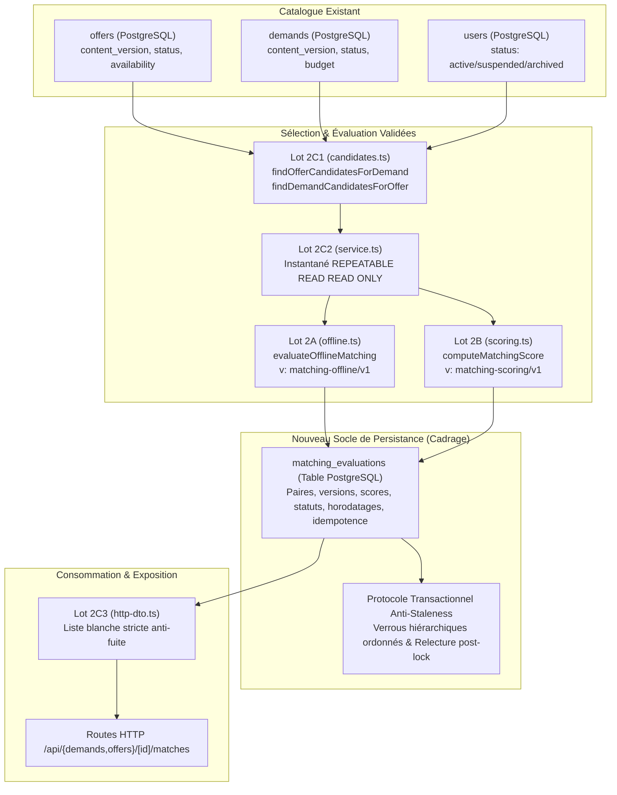

# MATCHING-PERSISTENCE-PLAN.md — Cadrage Technique de la Persistance du Matching et de son Invalidation

Ce document définit l'architecture technique, le modèle relationnel, les règles d'invalidation, les garanties transactionnelles et la trajectoire d'implémentation pour la persistance des évaluations de matching sur l'application **noma / Scoutr**.

Ce livrable est un **cadrage technique exclusif** : aucune migration de base de données n'est exécutée, aucun worker n'est déployé et aucune route HTTP existante n'est modifiée.

---

## 1. Mapping Précis des Composants Réutilisés

Le modèle de persistance prolonge directement les moteurs déterministes validés sans aucune réimplémentation ni divergence de logique métier :



| Composant | Rôle & Fichiers sources | Réemploi dans la persistance |
|---|---|---|
| **Lot 2A** | [`lib/server/matching/offline.ts`](file:///home/aegonjs/Documents/workspeace/Fresh/noma/lib/server/matching/offline.ts)<br/>`evaluateOfflineMatching` | Fournit `compatibilityStatus` (`compatible`, `incompatible`, `unknown`), `eligibilityStatus`, les détails par critère et la synthèse chiffrée. Version figée : `matching-offline/v1`. |
| **Lot 2B** | [`lib/server/matching/scoring.ts`](file:///home/aegonjs/Documents/workspeace/Fresh/noma/lib/server/matching/scoring.ts)<br/>`computeMatchingScore` | Fournit `score` (0–100 ou null), `coverage` (0–100 ou null), `scoring.summary` et `preferences.summary`. Version figée : `matching-scoring/v1`. |
| **Lot 2C1** | [`lib/server/matching/candidates.ts`](file:///home/aegonjs/Documents/workspeace/Fresh/noma/lib/server/matching/candidates.ts)<br/>Sélection SQL bornée | Sélectionne les candidats éligibles (exclusion auto-matching, statuts `published`/`active`, disponibilité `IS DISTINCT FROM 'unavailable'`). |
| **Lot 2C2** | [`lib/server/matching/service.ts`](file:///home/aegonjs/Documents/workspeace/Fresh/noma/lib/server/matching/service.ts)<br/>Transaction de lecture stable | Orchestration de l'évaluation dans un instantané `REPEATABLE READ READ ONLY` sur client dédié. Produit le résultat en mémoire à persister. |
| **Lot 2C3** | [`lib/server/matching/http-dto.ts`](file:///home/aegonjs/Documents/workspeace/Fresh/noma/lib/server/matching/http-dto.ts)<br/>Liste blanche stricte | Filtre les données persistées avant toute exposition HTTP. Exclut propriétaires tiers, texte brut, métadonnées d'extraction et preuves. Préserve les résultats `incompatible` et `unknown` avec leurs raisons explicables. |
| **Catalogue & Mutations** | [`lib/server/catalog/offers.ts`](file:///home/aegonjs/Documents/workspeace/Fresh/noma/lib/server/catalog/offers.ts)<br/>[`lib/server/catalog/demands.ts`](file:///home/aegonjs/Documents/workspeace/Fresh/noma/lib/server/catalog/demands.ts)<br/>[`lib/server/catalog/users.ts`](file:///home/aegonjs/Documents/workspeace/Fresh/noma/lib/server/catalog/users.ts)<br/>[`lib/server/catalog-extraction/application.ts`](file:///home/aegonjs/Documents/workspeace/Fresh/noma/lib/server/catalog-extraction/application.ts) | Incrémentation stricte `content_version = content_version + 1` et verrous `FOR UPDATE` lors de toute modification, transition de statut, application d'extraction ou suspension d'utilisateur. |

---

## 2. Modèle Proposé : Table `matching_evaluations`

Le modèle relationnel stocke une trace d'évaluation conjointe rattachée aux versions exactes des données sources, des moteurs et de l'identité d'idempotence de la tentative.

### Structure Détaillée de la Table

```sql
CREATE TABLE matching_evaluations (
    id UUID PRIMARY KEY DEFAULT gen_random_uuid(),

    -- 0. Identité persistante de la tentative et clé d'idempotence (obligatoires, sans défaut)
    idempotency_key UUID NOT NULL,
    attempt_hash TEXT NOT NULL,

    -- 1. Paire offre / demande et propriétaires
    offer_id UUID NOT NULL REFERENCES offers(id) ON DELETE CASCADE,
    demand_id UUID NOT NULL REFERENCES demands(id) ON DELETE CASCADE,
    offer_owner_id UUID NOT NULL REFERENCES users(id) ON DELETE CASCADE,
    demand_owner_id UUID NOT NULL REFERENCES users(id) ON DELETE CASCADE,

    -- 2. Versions des contenus évalués (instantané exact)
    offer_content_version INTEGER NOT NULL,
    demand_content_version INTEGER NOT NULL,

    -- 3. Versions des moteurs et configuration de scoring canonique
    engine_offline_version TEXT NOT NULL DEFAULT 'matching-offline/v1',
    engine_scoring_version TEXT NOT NULL DEFAULT 'matching-scoring/v1',
    scoring_config_hash TEXT NOT NULL,
    scoring_config JSONB NOT NULL DEFAULT '{}'::jsonb CHECK (jsonb_typeof(scoring_config) = 'object'),

    -- 4. Horodatages et cycle temporel (calculé depuis T_eval)
    evaluated_at TIMESTAMPTZ NOT NULL,
    persisted_at TIMESTAMPTZ NOT NULL DEFAULT CURRENT_TIMESTAMP,
    expires_at TIMESTAMPTZ, -- Plus petite frontière B = D + 1 ms strictement supérieure à evaluated_at

    -- 5. Statuts métier d'évaluation (Lots 2A et 2B)
    eligibility_status TEXT NOT NULL CHECK (eligibility_status IN ('eligible', 'ineligible')),
    eligibility_reasons TEXT[] NOT NULL DEFAULT '{}',
    compatibility_status TEXT NOT NULL CHECK (compatibility_status IN ('compatible', 'incompatible', 'unknown')),
    is_confirmed_match BOOLEAN GENERATED ALWAYS AS (
        compatibility_status = 'compatible' AND eligibility_status = 'eligible'
    ) STORED,

    -- 6. Indicateurs numériques explicables (Lot 2B : 0 à 6 décimales exactes)
    score NUMERIC(9, 6) CHECK (score IS NULL OR (score >= 0.000000 AND score <= 100.000000)),
    coverage NUMERIC(9, 6) CHECK (coverage IS NULL OR (coverage >= 0.000000 AND coverage <= 100.000000)),

    -- 7. Synthèses chiffrées structurées (sans preuves ni données privées)
    evaluation_summary JSONB NOT NULL CHECK (jsonb_typeof(evaluation_summary) = 'object'),
    scoring_summary JSONB NOT NULL CHECK (jsonb_typeof(scoring_summary) = 'object'),
    preferences_summary JSONB NOT NULL CHECK (jsonb_typeof(preferences_summary) = 'object'),

    -- 8. Détails internes complets (auditabilité interne, jamais exposés en HTTP)
    evaluation_details JSONB NOT NULL CHECK (jsonb_typeof(evaluation_details) = 'object'),

    -- 9. Indicateurs de fraîcheur et invalidation
    is_latest BOOLEAN NOT NULL DEFAULT TRUE,
    is_stale BOOLEAN NOT NULL DEFAULT FALSE,
    stale_reason TEXT CHECK (stale_reason IN (
        'offer_updated', 'demand_updated', 'offer_archived', 'demand_archived',
        'offer_unavailable', 'demand_satisfied', 'user_suspended', 'user_archived',
        'engine_superseded', 'temporal_expiry', 'superseded_by_reevaluation'
    )),
    staled_at TIMESTAMPTZ,

    -- Contraintes d'intégrité
    CONSTRAINT chk_matching_eval_different_owners CHECK (offer_owner_id <> demand_owner_id),
    CONSTRAINT chk_matching_eval_versions_positive CHECK (
        offer_content_version > 0 AND demand_content_version > 0
    ),
    CONSTRAINT uq_matching_evaluations_idempotency_key UNIQUE (idempotency_key)
);
```

---

## 3. Identité Persistante de Tentative, Unicité et Idempotence

### A. Exigence Stricte de `idempotency_key` et `attempt_hash`
Chaque tentative d'enregistrement d'une évaluation doit obligatoirement fournir :
1. `idempotency_key` (UUID) : clé d'idempotence stable générée par l'initiateur (worker ou orchestrateur de matching).
2. `attempt_hash` (TEXT) : hachage cryptographique calculé par le serveur depuis une représentation JSON canonique structurée, sans concaténation textuelle ambiguë :
   $$\text{attempt\_hash} = \text{SHA-256}(\text{canonicalJson}(\{ \text{demandId}, \text{demandContentVersion}, \text{engineOfflineVersion}, \text{engineScoringVersion}, \text{evaluatedAt}, \text{offerId}, \text{offerContentVersion}, \text{scoringConfigHash} \}))$$
   Toutes les clés de l'objet sont normalisées, triées alphabétiquement et les horodatages sont formatés en UTC ISO-8601 strict.

### B. Comportement Déterministe sur Collision de Clé d'Idempotence
La contrainte `uq_matching_evaluations_idempotency_key` est globale et inconditionnelle. Elle survit à l'invalidation (`is_stale = TRUE`).
Lorsqu'une persistance se présente avec une clé d'idempotence existante :
- **Même clé / Même empreinte** (`existing.attempt_hash === incoming.attempt_hash`) :
  Il s'agit d'une relance (retry réseau ou reprise de worker). Le serveur retourne l'enregistrement existant **strictement inchangé**, sans modifier `persisted_at` et **sans jamais le réactiver** (`is_stale` et `is_latest` restent dans leur état exact).
- **Même clé / Autres entrées** (`existing.attempt_hash !== incoming.attempt_hash`) :
  Il s'agit d'un conflit de réutilisation de clé. L'opération est rejetée immédiatement avec une exception métier typée `MatchingIdempotencyConflictError` (code HTTP 409 Conflict), sans aucune altération de données.

### C. Index Partiel d'Idempotence du Calcul Actif
Pour interdire à deux workers concurrents (avec deux clés d'idempotence distinctes) de persister deux calculs actifs simultanés pour les mêmes versions de contenu :

```sql
CREATE UNIQUE INDEX uq_matching_evaluations_calc ON matching_evaluations (
    offer_id,
    demand_id,
    offer_content_version,
    demand_content_version,
    engine_offline_version,
    engine_scoring_version,
    scoring_config_hash
) WHERE (is_stale = FALSE);
```

Dès qu'une évaluation est invalidée (`is_stale = TRUE`), elle sort de cet index partiel, libérant l'espace pour une évaluation ultérieure sous une nouvelle identité de tentative.

### D. Index Partiel d'Évaluation Active par Paire
Pour garantir qu'une paire `(offer_id, demand_id)` ne possède qu'une seule évaluation courante `is_latest = TRUE` :

```sql
CREATE UNIQUE INDEX uq_matching_evaluations_latest ON matching_evaluations (
    offer_id,
    demand_id
) WHERE (is_latest = TRUE);
```

---

## 4. Protocole Transactionnel de Concurrence et Ordre Unique de Verrouillage

### A. Ordre Global de Verrouillage Hiérarchique

Pour garantir l'absence d'interblocage structurel entre les mutations du catalogue, les mises à jour de comptes et les persistances d'évaluations, un **ordre unique et univoque** est strictement appliqué dans le texte et le pseudo-SQL :

$$\text{Identité de tentative} \longrightarrow \text{Comptes ordonnés} \longrightarrow \text{Ressources ordonnées} \longrightarrow \text{Paire de matching} \longrightarrow \text{Lignes d'évaluation}$$

1. **Identité de tentative** :
   Sérialisation de la clé d'idempotence via un verrou consultatif transactionnel de clé :
   `SELECT pg_advisory_xact_lock(1314664947, hashtext($idempotency_key::text));`
   Cette étape sérialise immédiatement deux requêtes concurrentes partageant la même clé, **y compris si elles ciblent des paires différentes**.
2. **Comptes utilisateurs ordonnés (`users`)** :
   Tri lexicographique des UUIDs propriétaires :
   $$u_1 = \text{LEAST}(\text{offer\_owner\_id}, \text{demand\_owner\_id}), \quad u_2 = \text{GREATEST}(\text{offer\_owner\_id}, \text{demand\_owner\_id})$$
   Verrouillage `FOR SHARE` sur $u_1$ puis $u_2$.
   *Compatibilité mutations* : `updateUser` ou `archiveUser` acquièrent `FOR UPDATE` sur le compte. La persistance en `FOR SHARE` attend la validation de toute suspension ou archivage en cours sans inversion d'ordre.
3. **Ressources catalogue ordonnées (`demands`, `offers`) avec départage par type/id** :
   Les deux ressources sont ordonnées par le tuple `(type_table, id)` où la chaîne `'demands'` précède strictement `'offers'` :
   $$r_1 = \text{'demands:'} \,\|\, \text{demand\_id}, \quad r_2 = \text{'offers:'} \,\|\, \text{offer\_id}$$
   La transaction verrouille systématiquement la table `demands WHERE id = $demand_id FOR SHARE`, puis la table `offers WHERE id = $offer_id FOR SHARE`.
   *Compatibilité mutations* : les écritures du catalogue (`updateOffer`, `updateDemand`, transitions d'état) verrouillent une seule ressource en `FOR UPDATE`. La persistance en `FOR SHARE` attend la libération du verrou exclusif.
4. **Paire de matching** :
   Sérialisation de la paire ordonnée $$(O, D)$$ via un verrou consultatif transactionnel :
   `SELECT pg_advisory_xact_lock(1314664946, hashtext(LEAST($offer_id::text, $demand_id::text) || ':' || GREATEST($offer_id::text, $demand_id::text)));`
   Garantit la sérialisation stricte de la paire, **même lorsqu'aucune évaluation n'existe encore en base**.
5. **Lignes d'évaluation (`matching_evaluations`)** :
   Verrouillage `FOR UPDATE` des évaluations courantes de la paire.

### B. Réglages Transactionnels Locaux (`SET LOCAL`)
Afin de ne jamais altérer la configuration partagée de la connexion retournée au pool PostgreSQL, tous les paramètres de protection sont définis avec `SET LOCAL` :
```sql
SET LOCAL lock_timeout = '3s';
SET LOCAL statement_timeout = '5s';
```

### C. Barrière Historique contre les Anciennes Tentatives
Une difficulté majeure survient lorsqu'une tentative retardée $W_1$ (calculée à $t_1$) arrive alors qu'une tentative plus récente $W_2$ (calculée à $t_2 > t_1$) a déjà été invalidée par une mutation : **il n'existe alors plus aucune ligne avec `is_latest = TRUE` en base**.
Si la transaction se contentait de chercher la ligne active `is_latest = TRUE`, elle ne trouverait rien et risquerait d'insérer $W_1$ comme nouvelle ligne active, réactivant un résultat obsolète.

**Règle de la Barrière Historique** :
La transaction consulte l'historique complet de la paire (lignes actives ET périmées) :
```sql
SELECT MAX(evaluated_at) AS max_evaluated_at
FROM matching_evaluations
WHERE offer_id = $offer_id AND demand_id = $demand_id;
```
Si `incoming_evaluated_at < max_evaluated_at` :
Une évaluation plus récente a déjà existé pour cette paire.
**Issue unique et déterministe** :
- La transaction effectue un `ROLLBACK` immédiat et rejette la tentative avec une exception typée `StaleAttemptSupersededError` (code HTTP 409).
- Zéro écriture en base de données.
- En cas de rejeu ultérieur avec la même clé, le comportement est parfaitement déterministe : la tentative n'ayant pas été insérée, elle est à nouveau refusée avec `StaleAttemptSupersededError`.

### D. Pseudo-SQL Cohérent et Complet de Persistance

```sql
BEGIN ISOLATION LEVEL READ COMMITTED;

-- 1. Réglages transactionnels locaux (portée limitée à la transaction courante)
SET LOCAL lock_timeout = '3s';
SET LOCAL statement_timeout = '5s';

-- 2. Sérialisation globale sur la clé d'idempotence (couvre même les paires distinctes)
SELECT pg_advisory_xact_lock(1314664947, hashtext($idempotency_key::text));

-- 3. Contrôle d'idempotence de la tentative
SELECT id, attempt_hash, is_latest, is_stale, stale_reason, evaluated_at
  FROM matching_evaluations
 WHERE idempotency_key = $idempotency_key;
-- Si une ligne existe :
--   Si attempt_hash = $incoming_attempt_hash :
--     COMMIT; RETURN résultat existant tel quel (is_stale et is_latest strictement inchangés).
--   Sinon :
--     ROLLBACK; THROW MatchingIdempotencyConflictError(409);

-- 4. Verrouillage ordonné des comptes utilisateurs (FOR SHARE)
--    u_first = LEAST(offer_owner_id, demand_owner_id), u_second = GREATEST(offer_owner_id, demand_owner_id)
SELECT id, status FROM users WHERE id = $u_first FOR SHARE;
SELECT id, status FROM users WHERE id = $u_second FOR SHARE;

-- 5. Verrouillage ordonné des ressources avec départage strict par type ('demands' puis 'offers')
SELECT id, content_version, status, deadline_at, owner_id FROM demands WHERE id = $demand_id FOR SHARE;
SELECT id, content_version, status, availability_status, deadline_at, owner_id FROM offers WHERE id = $offer_id FOR SHARE;

-- 6. Sérialisation de la paire de matching
SELECT pg_advisory_xact_lock(
    1314664946,
    hashtext(LEAST($offer_id::text, $demand_id::text) || ':' || GREATEST($offer_id::text, $demand_id::text))
);

-- 7. Relecture post-lock des versions, statuts et comptes
--    Vérification stricte de fraîcheur :
--    uo.status = 'active' AND ud.status = 'active' AND o.owner_id <> d.owner_id
--    AND o.status = 'published' AND o.availability_status IS DISTINCT FROM 'unavailable' AND d.status = 'active'
--    AND o.content_version = $expected_offer_version AND d.content_version = $expected_demand_version
--    Si l'un des contrôles échoue : ROLLBACK; RETURN { inserted: false, reason: 'stale_preconditions' };

-- 8. Contrôle d'horloge fraîche post-lock vs expiration
--    Après l'attente des verrous, lecture d'une horloge fraîche :
--    SELECT clock_timestamp() AS fresh_now;
--    Si $expires_at IS NOT NULL ET fresh_now >= $expires_at :
--      ROLLBACK; THROW EvaluationExpiredDuringLockWaitError;

-- 9. Barrière historique contre les tentatives anciennes retardées
SELECT MAX(evaluated_at) AS max_evaluated_at
  FROM matching_evaluations
 WHERE offer_id = $offer_id AND demand_id = $demand_id;
-- Si max_evaluated_at IS NOT NULL ET $evaluated_at < max_evaluated_at :
--   ROLLBACK; THROW StaleAttemptSupersededError;

-- 10. Archivage atomique de l'évaluation courante active (si présente)
UPDATE matching_evaluations
   SET is_latest = FALSE,
       is_stale = TRUE,
       stale_reason = 'superseded_by_reevaluation',
       staled_at = clock_timestamp()
 WHERE offer_id = $offer_id AND demand_id = $demand_id AND is_latest = TRUE;

-- 11. Insertion de la nouvelle évaluation active
INSERT INTO matching_evaluations (
    idempotency_key, attempt_hash,
    offer_id, demand_id, offer_owner_id, demand_owner_id,
    offer_content_version, demand_content_version,
    engine_offline_version, engine_scoring_version, scoring_config_hash, scoring_config,
    evaluated_at, expires_at,
    eligibility_status, eligibility_reasons, compatibility_status,
    score, coverage,
    evaluation_summary, scoring_summary, preferences_summary, evaluation_details,
    is_latest, is_stale
) VALUES (
    $idempotency_key, $attempt_hash,
    $offer_id, $demand_id, $offer_owner_id, $demand_owner_id,
    $offer_content_version, $demand_content_version,
    $engine_offline_version, $engine_scoring_version, $scoring_config_hash, $scoring_config,
    $evaluated_at, $expires_at,
    $eligibility_status, $eligibility_reasons, $compatibility_status,
    $score, $coverage,
    $evaluation_summary, $scoring_summary, $preferences_summary, $evaluation_details,
    TRUE, FALSE
);

COMMIT;
```

---

## 5. Algorithme Temporel Exact, Horloge Fraîche et Prédicat de Fraîcheur

### A. Algorithme Exact de Calcul de `expires_at`

L'algorithme temporel respecte rigoureusement la sémantique de comparaison du Lot 2A ([`lib/server/matching/offline.ts`](file:///home/aegonjs/Documents/workspeace/Fresh/noma/lib/server/matching/offline.ts)) :

1. **Horloge de référence $T_{\text{eval}}$** :
   $T_{\text{eval}}$ est l'instant exact utilisé par Lot 2A (`now`), exprimé en millisecondes JavaScript (`now.getTime()`).
   Pour chaque deadline $D$ présente (`demand.deadlineAt`, `offer.deadlineAt`), on utilise exactement sa valeur `Date.getTime()` telle que vue par Lot 2A.
2. **Frontière de changement d'état ($B = D + 1\text{ ms}$)** :
   Puisque Lot 2A considère la date expirée lorsque :
   ```typescript
   dDate.getTime() < now.getTime()
   ```
   Tant que $\text{now} \le D$, la condition $< \text{now}$ est fausse (délai respecté).
   Le basculement vers l'état expiré (`mismatched`) se produit exactement lorsque $\text{now} = D + 1\text{ milliseconde}$.
   La frontière de changement d'état temporel est donc :
   $$B = D + 1\text{ milliseconde}$$
3. **Calcul de `expires_at`** :
   `expires_at` est la **plus petite frontière $B$ strictement supérieure à $T_{\text{eval}}$**, parmi les deadlines présentes :
   $$\text{expires\_at} = \min \{ D + 1\text{ ms} \mid D \text{ présent et } D + 1\text{ ms} > T_{\text{eval}} \}$$
   S'il n'existe aucune frontière future ($D + 1\text{ ms} \le T_{\text{eval}}$ pour toutes les deadlines présentes, ou aucune deadline renseignée) :
   $$\text{expires\_at} = \text{NULL}$$
4. **Sémantique de la valeur `NULL`** :
   Cette valeur `NULL` signifie : **« aucun changement temporel restant pour ce résultat déjà recalculé »**.
   - Lorsqu'une deadline $D$ était antérieure à $T_{\text{eval}}$, Lot 2A a déjà calculé le résultat avec cette date expirée (`mismatched` $\rightarrow$ `incompatible` ou `ineligible`).
   - Le statut de cette paire est désormais stabilisé et ne changera plus jamais sous l'effet du temps seul.
   - `expires_at = NULL` ne rend **JAMAIS** compatible une paire que 2A déclare incompatible !
5. **Calcul depuis $T_{\text{eval}}$ uniquement** :
   La borne `expires_at` est calculée exclusivement depuis $T_{\text{eval}}$, jamais depuis l'heure de persistance pour prolonger artificiellement un ancien résultat.

### B. Contrôle d'Horloge Fraîche Post-Lock
L'attente des verrous `FOR SHARE` sur les ressources ou les comptes peut durer plusieurs secondes.
Une fois tous les verrous acquis, la transaction lit l'horloge fraîche `fresh_now = clock_timestamp()` :
- Si `expires_at IS NOT NULL` et `fresh_now >= expires_at` :
  Une frontière d'échéance a été franchie **pendant l'attente du verrou**. Les résultats calculés en mémoire à $T_{\text{eval}}$ ne correspondent plus à la réalité temporelle actuelle.
- **Issue** : La transaction annule (`ROLLBACK`) avec l'exception `EvaluationExpiredDuringLockWaitError`. L'orchestrateur est invité à relancer une nouvelle tentative sous une nouvelle clé d'idempotence, réévaluant réellement Lots 2A et 2B avec une horloge à jour.

### C. Prédicat SQL Unique de Consultation / Lecture Fraîche

Lors de toute lecture opérationnelle d'une évaluation active, le serveur exécute une requête conditionnée par une **horloge fraîche unique** `clock_timestamp()` :

```sql
WITH current_clock AS (
    SELECT clock_timestamp() AS fresh_now
)
SELECT e.*
FROM matching_evaluations e
JOIN offers o ON o.id = e.offer_id
JOIN demands d ON d.id = e.demand_id
JOIN users uo ON uo.id = e.offer_owner_id
JOIN users ud ON ud.id = e.demand_owner_id
CROSS JOIN current_clock c
WHERE e.offer_id = $offer_id AND e.demand_id = $demand_id
  -- 1. Évaluation courante non invalidée
  AND e.is_latest = TRUE
  AND e.is_stale = FALSE
  -- 2. Concordance exacte des versions de contenu
  AND o.content_version = e.offer_content_version
  AND d.content_version = e.demand_content_version
  -- 3. Concordance des propriétaires enregistrés et non auto-matching
  AND e.offer_owner_id = o.owner_id
  AND e.demand_owner_id = d.owner_id
  AND o.owner_id <> d.owner_id
  -- 4. Statuts et éligibilité des ressources catalogue
  AND o.status = 'published'
  AND o.availability_status IS DISTINCT FROM 'unavailable'
  AND d.status = 'active'
  -- 5. Statuts des comptes utilisateurs propriétaires
  AND uo.status = 'active'
  AND ud.status = 'active'
  -- 6. Versions des moteurs et configuration canonique
  AND e.engine_offline_version = $expected_engine_offline_version
  AND e.engine_scoring_version = $expected_engine_scoring_version
  AND e.scoring_config_hash = $expected_scoring_config_hash
  -- 7. Validité temporelle active sous horloge fraîche
  AND (e.expires_at IS NULL OR e.expires_at > c.fresh_now);
```

---

## 6. Inventaire des Mutations et Adaptations Transactionnelles

Toute opération modifiant le catalogue ou le statut des utilisateurs doit invalider de façon synchrone, au sein de sa propre transaction, les évaluations de matching concernées.

| Fichier source | Fonction exacte | Action métier | Adaptation transactionnelle d'invalidation |
|---|---|---|---|
| [`lib/server/catalog/offers.ts`](file:///home/aegonjs/Documents/workspeace/Fresh/noma/lib/server/catalog/offers.ts) | `updateOffer` | Modifie contenu ou disponibilité, incrémente `content_version`. | Invalidation synchrone :<br/>`UPDATE matching_evaluations SET is_stale = TRUE, is_latest = FALSE, stale_reason = 'offer_updated', staled_at = CURRENT_TIMESTAMP WHERE offer_id = $id AND is_latest = TRUE;` |
| [`lib/server/catalog/offers.ts`](file:///home/aegonjs/Documents/workspeace/Fresh/noma/lib/server/catalog/offers.ts) | `archiveOffer` | Passe le statut à `'archived'`, incrémente `content_version`. | Invalidation synchrone avec `stale_reason = 'offer_archived'`. |
| [`lib/server/catalog/offers.ts`](file:///home/aegonjs/Documents/workspeace/Fresh/noma/lib/server/catalog/offers.ts) | `publishOffer`, `pauseOffer`, `transitionOfferStatus` | Transition de statut d'offre avec `FOR UPDATE`, incrémente `content_version`. | Invalidation synchrone au sein de `withPostgresTransaction` avec `stale_reason = 'offer_updated'`. |
| [`lib/server/catalog/demands.ts`](file:///home/aegonjs/Documents/workspeace/Fresh/noma/lib/server/catalog/demands.ts) | `updateDemand` | Modifie critères, budget, exigences ou préférences, incrémente `content_version`. | Invalidation synchrone :<br/>`UPDATE matching_evaluations SET is_stale = TRUE, is_latest = FALSE, stale_reason = 'demand_updated', staled_at = CURRENT_TIMESTAMP WHERE demand_id = $id AND is_latest = TRUE;` |
| [`lib/server/catalog/demands.ts`](file:///home/aegonjs/Documents/workspeace/Fresh/noma/lib/server/catalog/demands.ts) | `archiveDemand` | Passe le statut à `'archived'`, incrémente `content_version`. | Invalidation synchrone avec `stale_reason = 'demand_archived'`. |
| [`lib/server/catalog/demands.ts`](file:///home/aegonjs/Documents/workspeace/Fresh/noma/lib/server/catalog/demands.ts) | `activateDemand`, `satisfyDemand`, `transitionDemandStatus` | Transition de statut de demande avec `FOR UPDATE`, incrémente `content_version`. | Invalidation synchrone dans la transaction : `stale_reason = 'demand_satisfied'` (si target = satisfied) ou `'demand_updated'`. |
| [`lib/server/catalog-extraction/application.ts`](file:///home/aegonjs/Documents/workspeace/Fresh/noma/lib/server/catalog-extraction/application.ts) | `applyCatalogExtractionProposal` | Applique les champs extraits sur une offre ou demande sous `FOR UPDATE`, incrémente `content_version`. | Invalidation synchrone de la ressource cible avant validation du commit avec `offer_updated` ou `demand_updated`. |
| [`lib/server/catalog/users.ts`](file:///home/aegonjs/Documents/workspeace/Fresh/noma/lib/server/catalog/users.ts) | `updateUser` | Modifie le statut utilisateur (`'active'`, `'suspended'`), incrémente `version`. | Si passage à `'suspended'` : invalidation synchrone de toutes les évaluations courantes où `offer_owner_id = $id OR demand_owner_id = $id` avec `stale_reason = 'user_suspended'`. |
| [`lib/server/catalog/users.ts`](file:///home/aegonjs/Documents/workspeace/Fresh/noma/lib/server/catalog/users.ts) | `archiveUser` | Passe le statut utilisateur à `'archived'`, incrémente `version`. | Invalidation synchrone définitive de toutes les évaluations de l'utilisateur avec `stale_reason = 'user_archived'`. |

### Précision sur les Offres `reserved`
Une offre avec `availability_status = 'reserved'` reste éligible dans les moteurs Lots 2A et 2C1 (`availability_status IS DISTINCT FROM 'unavailable'`). Toutefois :
- Le passage à l'état `reserved` via `updateOffer` incrémente obligatoirement `content_version = content_version + 1`.
- L'instantané d'évaluation calculé sous l'ancienne version devient donc **obsolète** et doit être invalidé (`offer_updated`).
- La réévaluation suivante de cette offre en version $N+1$ avec le statut `reserved` est admise, évaluée et persistée avec son nouveau `content_version`.

---

## 7. Précision Numérique, Configuration Canonique et Validations JSONB

### A. Représentation Numérique Exacte : `NUMERIC(9, 6)`
- `score NUMERIC(9, 6) CHECK (score IS NULL OR (score >= 0.000000 AND score <= 100.000000))`
- `coverage NUMERIC(9, 6) CHECK (coverage IS NULL OR (coverage >= 0.000000 AND coverage <= 100.000000))`
- Justification : Le Lot 2B supporte une précision configurable jusqu'à 6 décimales. `NUMERIC(9, 6)` empêche l'arrondi faux d'un score de `99.999999` vers `100.000000`, préservant rigoureusement l'invariant 2B qui réserve le score 100 aux correspondances parfaites sans aucune obligation inconnue ou contredite.

### B. Canonicalisation de la Configuration de Scoring (`scoring_config_hash`)
La colonne `scoring_config_hash` est le hachage SHA-256 de la chaîne JSON canonique de la configuration de scoring :
1. Tri récursif alphabétique de toutes les clés d'objets.
2. Normalisation des formats numériques sans zéros superflus.
3. Deux configurations sémantiquement équivalentes produisent un hash identique indépendamment de l'ordre des clés dans l'objet d'entrée.

### C. Contraintes Structurelles sur les Données JSONB
Chaque colonne JSONB fait l'objet d'une validation stricte au niveau SQL :
```sql
CHECK (jsonb_typeof(scoring_config) = 'object'),
CHECK (jsonb_typeof(evaluation_summary) = 'object'),
CHECK (jsonb_typeof(scoring_summary) = 'object'),
CHECK (jsonb_typeof(preferences_summary) = 'object'),
CHECK (jsonb_typeof(evaluation_details) = 'object')
```

---

## 8. Politique de Rétention et Conservation des Identités

1. **Conservation Intégrale dans ce Premier Lot (Lot 2E)** :
   Dans ce lot de cadrage et sa première implémentation, **aucune purge différée n'est exécutée**. Toutes les identités de tentatives (`idempotency_key`), toutes les évaluations historiques (`is_stale = TRUE, is_latest = FALSE`) et leurs synthèses d'auditabilité sont intégralement conservées en base pour la traçabilité des décisions et la détection d'anomalies.
2. **Impact Maîtrisé sur les Index Partiels** :
   Les index partiels opérationnels (`idx_matching_eval_demand_confirmed`, `idx_matching_eval_offer_confirmed`, `uq_matching_evaluations_latest`, `uq_matching_evaluations_calc`) ne stockent que les lignes actives (`is_latest = TRUE AND is_stale = FALSE`).
   L'accumulation de lignes historiques n'augmente pas la taille de l'arbre d'indexation actif. Les écritures et invalidations génèrent toutefois des écritures de pages et de journaux WAL standards dans PostgreSQL.

---

## 9. Migration Additive Proposée : `0006_matching_evaluations.sql`

```sql
-- Migration 0006_matching_evaluations.sql
-- Persistance des évaluations de matching (Lot 2E)

CREATE TABLE IF NOT EXISTS matching_evaluations (
    id UUID PRIMARY KEY DEFAULT gen_random_uuid(),
    idempotency_key UUID NOT NULL,
    attempt_hash TEXT NOT NULL,
    offer_id UUID NOT NULL REFERENCES offers(id) ON DELETE CASCADE,
    demand_id UUID NOT NULL REFERENCES demands(id) ON DELETE CASCADE,
    offer_owner_id UUID NOT NULL REFERENCES users(id) ON DELETE CASCADE,
    demand_owner_id UUID NOT NULL REFERENCES users(id) ON DELETE CASCADE,
    offer_content_version INTEGER NOT NULL,
    demand_content_version INTEGER NOT NULL,
    engine_offline_version TEXT NOT NULL DEFAULT 'matching-offline/v1',
    engine_scoring_version TEXT NOT NULL DEFAULT 'matching-scoring/v1',
    scoring_config_hash TEXT NOT NULL,
    scoring_config JSONB NOT NULL DEFAULT '{}'::jsonb CHECK (jsonb_typeof(scoring_config) = 'object'),
    evaluated_at TIMESTAMPTZ NOT NULL,
    persisted_at TIMESTAMPTZ NOT NULL DEFAULT CURRENT_TIMESTAMP,
    expires_at TIMESTAMPTZ,
    eligibility_status TEXT NOT NULL CHECK (eligibility_status IN ('eligible', 'ineligible')),
    eligibility_reasons TEXT[] NOT NULL DEFAULT '{}',
    compatibility_status TEXT NOT NULL CHECK (compatibility_status IN ('compatible', 'incompatible', 'unknown')),
    is_confirmed_match BOOLEAN GENERATED ALWAYS AS (
        compatibility_status = 'compatible' AND eligibility_status = 'eligible'
    ) STORED,
    score NUMERIC(9, 6) CHECK (score IS NULL OR (score >= 0.000000 AND score <= 100.000000)),
    coverage NUMERIC(9, 6) CHECK (coverage IS NULL OR (coverage >= 0.000000 AND coverage <= 100.000000)),
    evaluation_summary JSONB NOT NULL CHECK (jsonb_typeof(evaluation_summary) = 'object'),
    scoring_summary JSONB NOT NULL CHECK (jsonb_typeof(scoring_summary) = 'object'),
    preferences_summary JSONB NOT NULL CHECK (jsonb_typeof(preferences_summary) = 'object'),
    evaluation_details JSONB NOT NULL CHECK (jsonb_typeof(evaluation_details) = 'object'),
    is_latest BOOLEAN NOT NULL DEFAULT TRUE,
    is_stale BOOLEAN NOT NULL DEFAULT FALSE,
    stale_reason TEXT CHECK (stale_reason IN (
        'offer_updated', 'demand_updated', 'offer_archived', 'demand_archived',
        'offer_unavailable', 'demand_satisfied', 'user_suspended', 'user_archived',
        'engine_superseded', 'temporal_expiry', 'superseded_by_reevaluation'
    )),
    staled_at TIMESTAMPTZ,
    CONSTRAINT chk_matching_eval_different_owners CHECK (offer_owner_id <> demand_owner_id),
    CONSTRAINT chk_matching_eval_versions_positive CHECK (
        offer_content_version > 0 AND demand_content_version > 0
    ),
    CONSTRAINT uq_matching_evaluations_idempotency_key UNIQUE (idempotency_key)
);

-- Index pour la consultation rapide des matchs confirmés actifs d'une demande
CREATE INDEX IF NOT EXISTS idx_matching_eval_demand_confirmed ON matching_evaluations (
    demand_id,
    score DESC NULLS LAST,
    evaluated_at DESC
) WHERE (is_latest = TRUE AND is_stale = FALSE AND is_confirmed_match = TRUE);

-- Index pour la consultation rapide des matchs confirmés actifs d'une offre
CREATE INDEX IF NOT EXISTS idx_matching_eval_offer_confirmed ON matching_evaluations (
    offer_id,
    score DESC NULLS LAST,
    evaluated_at DESC
) WHERE (is_latest = TRUE AND is_stale = FALSE AND is_confirmed_match = TRUE);

-- Index pour le nettoyage et l'invalidation temporelle
CREATE INDEX IF NOT EXISTS idx_matching_eval_expires ON matching_evaluations (
    expires_at
) WHERE (is_latest = TRUE AND is_stale = FALSE AND expires_at IS NOT NULL);

-- Index d'unicité active par paire (au plus une évaluation active 'latest' par couple offre/demande)
CREATE UNIQUE INDEX IF NOT EXISTS uq_matching_evaluations_latest ON matching_evaluations (
    offer_id,
    demand_id
) WHERE (is_latest = TRUE);

-- Index partiel d'idempotence des calculs exacts non périmés
CREATE UNIQUE INDEX IF NOT EXISTS uq_matching_evaluations_calc ON matching_evaluations (
    offer_id,
    demand_id,
    offer_content_version,
    demand_content_version,
    engine_offline_version,
    engine_scoring_version,
    scoring_config_hash
) WHERE (is_stale = FALSE);
```

---

## 10. Chronologies de Concurrence Résolues

### Chronologie 1 : Même clé d'idempotence présentée pour deux paires distinctes
```text
T1 (Client A) : Tente de persister Paire (O1, D1) avec idempotency_key = K1.
T2 (Client B) : Tente de persister Paire (O2, D2) avec la MÊME idempotency_key = K1.
  1. Transaction A acquiert pg_advisory_xact_lock(1314664947, hashtext(K1)).
  2. Transaction B demande le verrou advisory sur K1 -> mise en attente.
  3. Transaction A constate que K1 n'existe pas, valide les contrôles et insère (O1, D1) avec K1 et attempt_hash = H(O1, D1). COMMIT.
  4. Transaction B se débloque, interroge matching_evaluations WHERE idempotency_key = K1.
  5. Transaction B trouve l'enregistrement inséré par A.
  6. Transaction B compare existing.attempt_hash avec incoming.attempt_hash = H(O2, D2).
  7. Les hashs divergent (H(O1, D1) != H(O2, D2)).
  8. Transaction B effectue un ROLLBACK et lève MatchingIdempotencyConflictError (HTTP 409 Conflict).
  Résultat : Zéro collision, intégrité absolue de la clé d'idempotence.
```

### Chronologie 2 : Ancienne tentative arrivant après invalidation de la ligne courante
```text
T1 (Worker W1) : Évalue à t_1 = 10:00:00. W1 subit un gel réseau.
T2 (Worker W2) : Évalue à t_2 = 10:05:00 (t_2 > t_1), acquiert les verrous et insère avec evaluated_at = 10:05:00, is_latest = TRUE.
T3 (Mutation)  : updateOffer incrémente content_version et invalide W2 (is_stale = TRUE, is_latest = FALSE).
                 Aucune ligne is_latest = TRUE ne subsiste en base pour cette paire.
T4 (Worker W1) : W1 se réveille à 10:07:00 et tente de persister son évaluation de 10:00:00.
  1. W1 démarre sa transaction, acquiert l'advisory lock de clé, les verrous users et ressources FOR SHARE, puis l'advisory lock de paire.
  2. W1 interroge la barrière historique :
     SELECT MAX(evaluated_at) AS max_evaluated_at FROM matching_evaluations WHERE offer_id = $O AND demand_id = $D;
  3. W1 lit max_evaluated_at = 10:05:00.
  4. W1 compare : incoming.evaluated_at (10:00:00) < max_evaluated_at (10:05:00).
  5. Bien qu'aucune ligne active is_latest = TRUE n'existe, la barrière historique détecte l'antériorité de la tentative.
  6. W1 effectue un ROLLBACK et lève StaleAttemptSupersededError (HTTP 409).
  Résultat : Aucune écriture de résultat obsolète, aucun écrasement fantôme.
```

### Chronologie 3 : Calcul avant $D$, persistance après la frontière $D + 1\text{ ms}$ (Rejet)
```text
Contexte       : Demande avec deadline D = '2032-01-01T12:00:00.000Z'.
                 Frontière de basculement Lot 2A : B = D + 1 ms = '2032-01-01T12:00:00.001Z'.
T1 (Calcul 2A) : Évaluation calculée en mémoire à T_eval = '2032-01-01T11:59:59.000Z' (T_eval < D).
                 2A déclare le délai respecté. Borne calculée : expires_at = B = '2032-01-01T12:00:00.001Z'.
T2 (Persist)   : Début transaction persistance à 11:59:59.500Z.
T3 (Attente)   : Forte contention : attente des verrous FOR SHARE sur l'offre pendant 1,5 seconde.
T4 (Déblocage) : Les verrous sont acquis à 12:00:01.000Z.
  1. La persistance lit l'horloge fraîche : fresh_now = clock_timestamp() ('2032-01-01T12:00:01.000Z').
  2. Elle compare : fresh_now >= expires_at ('2032-01-01T12:00:01.000Z' >= '2032-01-01T12:00:00.001Z') -> VRAI.
  3. La frontière de changement d'état temporel a été franchie pendant l'attente du verrou.
  4. La persistance effectue un ROLLBACK immédiat et lève EvaluationExpiredDuringLockWaitError.
  Résultat : Rejet propre de la tentative. Aucun résultat pré-expiration n'est écrit comme match actif après D + 1 ms.
```

### Chronologie 4 : Nouveau calcul après la frontière $D + 1\text{ ms}$ (Résultat Incompatible Enregistrable)
```text
Contexte       : Même demande avec deadline D = '2032-01-01T12:00:00.000Z'.
T1 (Rejeu)     : Suite au rejet de la chronologie 3, une nouvelle tentative est déclenchée.
T2 (Calcul 2A) : Évaluation calculée à T_eval = '2032-01-01T12:00:02.000Z' (T_eval > D).
                 Lot 2A constate D < now -> critère deadline 'mismatched' (DEMAND_EXPIRED) -> compatibility_status = 'incompatible'.
T3 (Algorithme): Calcul de la borne d'expiration :
                 Frontière B = D + 1 ms = '2032-01-01T12:00:00.001Z' <= T_eval ('2032-01-01T12:00:02.000Z').
                 Il n'existe aucune autre frontière future -> expires_at = NULL.
T4 (Persist)   : Persistance sous verrous ordonnés.
                 Contrôle post-lock : expires_at est NULL, aucun blocage temporel.
                 Insertion de la nouvelle ligne : compatibility_status = 'incompatible', is_confirmed_match = FALSE, expires_at = NULL.
  Résultat : Le résultat incompatible est persisté et stabilisé sans expiration future inutile.
             La valeur NULL ne rend jamais compatible ce résultat que 2A a déclaré incompatible.
```

### Chronologie 5 : Calcul exactement à l'échéance ($T_{\text{eval}} = D$)
```text
Contexte       : Demande avec deadline D = '2032-01-01T12:00:00.000Z'.
T1 (Calcul 2A) : Évaluation calculée à T_eval = '2032-01-01T12:00:00.000Z' (T_eval = D).
  1. Sémantique stricte Lot 2A : la condition dDate.getTime() < now.getTime() compare D < T_eval.
     À l'égalité exacte, D < D est FAUX. Le critère n'est donc pas encore expiré à cet instant précis.
  2. Frontière future B = D + 1 ms = '2032-01-01T12:00:00.001Z'.
     Comme B > T_eval, la plus petite borne future est : expires_at = '2032-01-01T12:00:00.001Z'.
  3. L'évaluation est persistée avec cette borne exacte.
  4. Dès la milliseconde suivante ('2032-01-01T12:00:00.001Z'), le prédicat de lecture (expires_at > fresh_now) échoue.
  Résultat : Respect mathématique absolu de l'égalité stricte de 2A et invalidation immédiate dès T_eval + 1 ms.
```

### Chronologie 6 : Aucune deadline présente
```text
Contexte       : Ni l'offre ni la demande ne portent de deadlineAt (valeurs nulles ou indéfinies).
T1 (Calcul 2A) : Critère deadline non applicable ou inconnu sans contrainte temporelle.
T2 (Algorithme): Aucune deadline présente -> aucune frontière temporelle B n'existe -> expires_at = NULL.
T3 (Persist)   : L'évaluation est persistée avec expires_at = NULL.
T4 (Lecture)   : Le prédicat SQL (expires_at IS NULL OR expires_at > fresh_now) valide immédiatement la clause temporelle.
  Résultat : Aucune expiration temporelle indue pour les ressources intemporelles.
```

---

## 11. Trajectoire d'Implémentation et Préservation des Contrats 2C3

### Trajectoire par Étapes
1. **Étape 1 : Cadrage et Arbitrages (Lot Actuel)** :
   Validation définitive du document `MATCHING-PERSISTENCE-PLAN.md`. Aucun code applicatif modifié.
2. **Étape 2 : Persistance Unitaire et Invalidation Synchrone (Prochain Lot)** :
   - Application de la migration additive `0006_matching_evaluations.sql`.
   - Création du repository `matching-persistence.ts` implémentant le protocole transactionnel complet (`SET LOCAL`, advisory locks ordonnés, relecture post-lock, algorithme temporel $B = D + 1\text{ ms}$, barrière historique).
   - Raccordement des hooks d'invalidation synchrone sur les mutations catalogue et utilisateur.
   - Tests d'intégration de concurrence PostgreSQL.
3. **Étape 3 : Déclenchement Asynchrone via Outbox / Jobs (Lot Ultérieur)** :
   - Table `matching_outbox_events` et jobs avec réservation `FOR UPDATE SKIP LOCKED`.

### Préservation des Contrats 2C3 et Confidentialité HTTP
1. **Conservation de l'intégralité des résultats métier** :
   La table stocke l'intégralité des évaluations (`compatible`, `incompatible`, `unknown`). Les routes 2C3 peuvent exposer à l'utilisateur non seulement ses matchs confirmés (`compatible` + `eligible`), mais également les évaluations détaillées avec leurs critères discriminants ou manquants.
2. **Confidentialité absolue (Zero Leak)** :
   L'API HTTP continue d'utiliser exclusivement [`lib/server/matching/http-dto.ts`](file:///home/aegonjs/Documents/workspeace/Fresh/noma/lib/server/matching/http-dto.ts). Les règles de filtrage par liste blanche interdisent toute fuite d'identifiants de propriétaires tiers, de texte brut, de métadonnées d'extraction ou de détails internes d'auditabilité.
